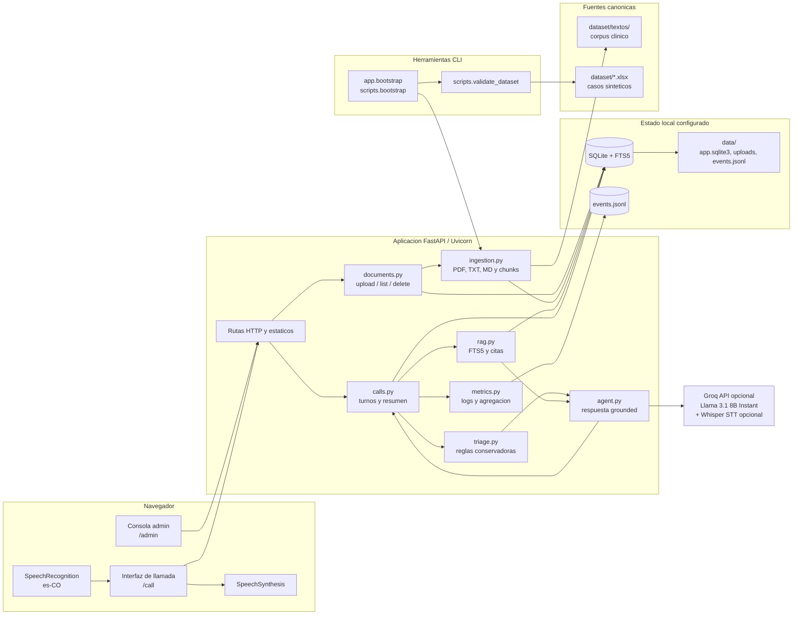
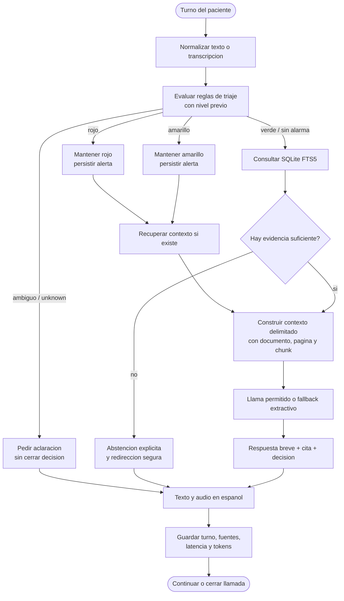
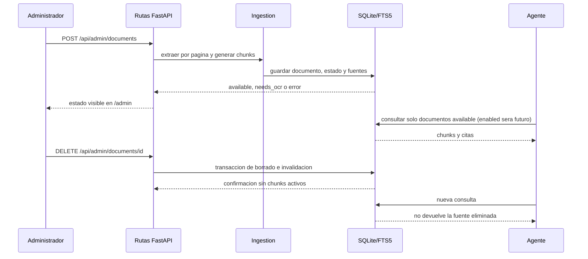

# Arquitectura del MVP

## Estado

Este documento describe la arquitectura implementada del MVP definido en
[`specs/00_mvp_specification.md`](../specs/00_mvp_specification.md). Al 2026-08-08 el
checkout contiene runtime en `app/`, pruebas en `tests/`, dependencias declaradas y los
scripts de validacion/bootstrap. La suite automatizada, Ruff, la validacion del dataset y el
bootstrap local estan verificados; el smoke manual de voz y la demo G5 con documento externo
siguen pendientes.

## Fuente normativa del siguiente corte

La especificacion completa del flujo, sus actores, etapas, submodulos, ASCII, Mermaid y matriz
de trazabilidad esta en
[`specs/06_system_flow_diagram_specification.md`](../specs/06_system_flow_diagram_specification.md).
Esta pagina es la vista publicada del baseline actual. No se deben agregar bloques nuevos aqui
sin actualizar primero la spec normativa y las specs upstream:

- [`specs/03_mvp_structure_specification.md`](../specs/03_mvp_structure_specification.md):
  entregables bajo `mvp/` y fases bajo `mvp/crisp-dm/`.
- [`specs/04_admin_document_lifecycle_specification.md`](../specs/04_admin_document_lifecycle_specification.md):
  preview, `enabled`, `rag_eligible`, enable, disable y delete.
- [`specs/05_patient_listening_timeout_specification.md`](../specs/05_patient_listening_timeout_specification.md):
  `PATIENT_LISTEN_TIMEOUT_MS` y estados de escucha.

En el baseline actual, preview, enable/disable y el timer configurable se marcan como
`PROPOSED` en la spec del diagrama; los diagramas de esta pagina describen lo que hoy existe y
no deben interpretarse como evidencia de esas extensiones.

| Cambio dependiente | Reflejo requerido en el diagrama | Estado del baseline |
|---|---|---|
| Reestructura | `mvp/crisp-dm/` y `mvp/deliverables/` como ownership de entrega | PROPOSED |
| Preview admin | flujo `GET .../preview` y texto no ejecutable | PROPOSED |
| Enable/disable | `enabled`, `rag_eligible` y filtro FTS5 | PROPOSED |
| Delete | invalidacion y olvido sin reinicio | IMPLEMENTED |
| Timeout paciente | `PATIENT_LISTEN_TIMEOUT_MS` y reintento/texto | PROPOSED |

## Principios

- Monolito local con FastAPI/Uvicorn y archivos estaticos; sin telefonia real.
- Dos superficies obligatorias: `/admin` y `/call`.
- SQLite con FTS5 como recuperacion lexical inicial, con fuentes, chunks y revision trazables.
- Reglas de triaje deterministas separadas de la salida del modelo.
- Respuestas en espanol, breves, grounded o explicitamente abstentivas.
- El corpus y el dataset bajo `dataset/` y `docs/` permanecen canonicos; el estado generado
  se escribe en el directorio `data/` configurado.
- Modelo de razonamiento seleccionado: `llama-3.1-8b-instant` via Groq, familia Meta Llama
  permitida. Con `GROQ_API_KEY` se habilita el adaptador remoto; sin ella se usa el fallback
  extractivo determinista.

## Componentes y flujo de datos

El adaptador Groq es opcional para pruebas locales: sin `GROQ_API_KEY`, el MVP conserva un
camino extractivo determinista basado en FTS5. La interfaz del navegador usa
`SpeechRecognition` con idioma `es-CO` y `SpeechSynthesis`; el endpoint de audio puede usar
`whisper-large-v3` via Groq cuando hay credencial. Ninguna prueba automatizada sustituye el
smoke manual de microfono y audio.

## Superficies y rutas implementadas

- `/admin`: consola estatica para subir, listar y eliminar documentos.
- `/call`: interfaz estatica para abrir una llamada, hablar o escribir, ver triaje y fuentes,
  y guardar el resumen.
- `GET /health`: estado del modelo configurado, FTS5, documentos, revision del corpus y modo
  de voz.
- `GET/POST/DELETE /api/admin/documents`: ciclo de vida sin reiniciar el proceso.
- `POST /api/calls`, `GET /api/calls/{call_id}`, `POST /api/calls/{call_id}/turns`,
  `POST /api/calls/{call_id}/audio` y `POST /api/calls/{call_id}/finish`: llamada browser/API.
- `GET /api/metrics`: agregacion de eventos de turnos y consumo instrumentado.

## Flujo de decision clinica

Las ramas rojas y amarillas no dependen de que el LLM recuerde la regla de seguridad. El
modelo puede redactar una respuesta, pero no puede degradar el nivel calculado ni convertir
un contexto no recuperado en una instruccion clinica. La implementacion automatizada cubre
rojo, amarillo, verde y `unknown`; la cobertura no equivale a un smoke de voz real.

## Conocimiento vivo

Un documento sin texto extraible se queda en `needs_ocr` y no entra en el indice disponible.
La prueba G5 debe demostrar upload, uso, delete y olvido sin reiniciar el proceso.

## Mapa de implementacion

| Area | Ruta | Responsabilidad y estado |
|---|---|---|
| Configuracion | `app/config.py` | Entorno, rutas y limites de archivos; implementado |
| Persistencia | `app/database.py` | SQLite, FTS5, transacciones y revision; implementado |
| Contratos | `app/schemas.py`, `app/main.py` | Entrada/salida y serializacion API; implementado |
| Dataset | `app/dataset.py`, `scripts/validate_dataset.py` | XLSX, JSON y joins de solo lectura; implementado |
| Bootstrap | `app/bootstrap.py`, `scripts/bootstrap.py` | Validacion, hash, ingestion e idempotencia; implementado |
| Ingestion | `app/services/ingestion.py` | PDF, TXT, MD, paginas, chunks y `needs_ocr`; implementado |
| Documentos | `app/services/documents.py` | Ciclo upload/process/delete; implementado |
| RAG | `app/services/rag.py` | FTS5, filtro `available` y citas; `enabled` futuro |
| Agente | `app/services/agent.py` | Groq opcional, fallback, abstencion y seguridad de salida; implementado |
| Seguridad | `app/services/triage.py` | Nivel conservador, alertas y aclaraciones; implementado |
| Llamadas | `app/services/calls.py` | Turnos, fuentes, alerta y resumen; implementado |
| Metricas | `app/services/metrics.py` | JSONL y agregacion P50/P95; implementado |
| Voz | `app/services/voice.py`, `app/web/app.js` | Whisper opcional, SpeechRecognition y SpeechSynthesis; smoke manual pendiente |
| Web | `app/main.py`, `app/web/` | API, `/admin` y `/call`; implementado |

La correspondencia del diagrama con el codigo esta cubierta por la suite automatizada y por
la verificacion local del bootstrap. La presencia del microfono y del audio en un navegador
compatible aun debe comprobarse manualmente.

## Evidencia del corte

- `python -m pytest -q --basetemp <temp>`: 38 tests pasaron.
- `ruff check .`: paso sin hallazgos.
- `python -m scripts.validate_dataset`: dataset valido, con filas `3991/40/40/160`.
- `python -m app.bootstrap --data-dir <temp>`: 104 documentos procesados, 103
  `available` y 1 `needs_ocr`.
- La prueba de idempotencia de bootstrap y el aprendizaje/olvido local pasan; G5 sigue
  pendiente de un documento externo en demo.
