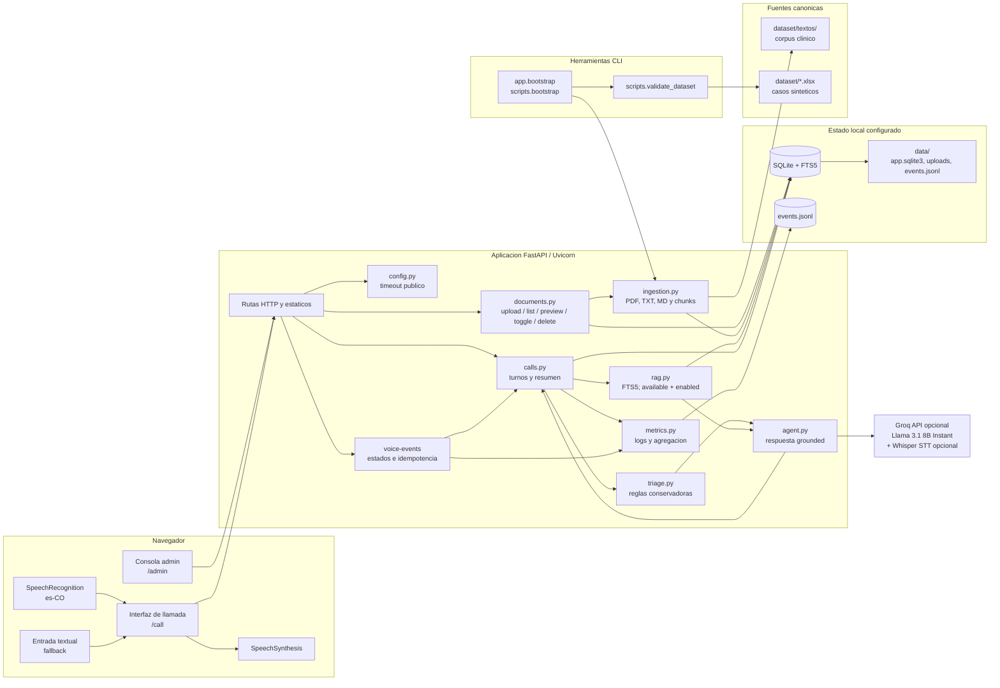
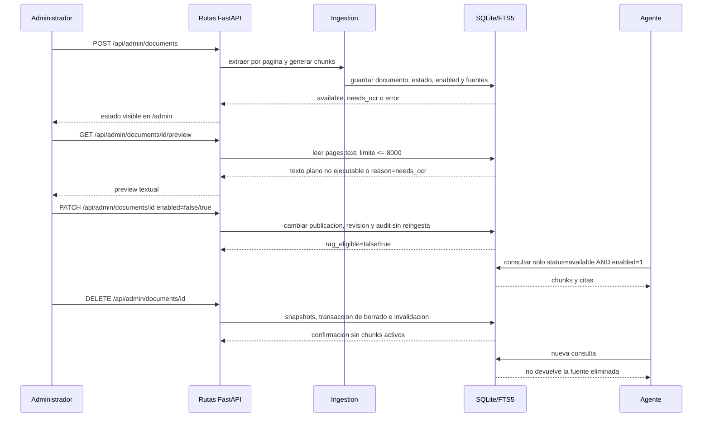

# Arquitectura del MVP

## Estado

Este documento describe la arquitectura implementada del MVP definido en
[`specs/00_mvp_specification.md`](../specs/00_mvp_specification.md). Al 2026-08-08 el
checkout contiene runtime en `app/`, pruebas en `tests/`, dependencias declaradas, la estructura
aplicada bajo `mvp/crisp-dm/` y `mvp/deliverables/`, y los scripts de validacion/bootstrap.
La suite automatizada, Ruff, la validacion del dataset y el bootstrap local estan verificados;
G2, el smoke manual de voz, Groq/Whisper real y la demo G5 con documento externo siguen
pendientes.

## Fuente normativa y vista derivada

La especificacion completa del flujo, sus actores, etapas, submodulos, ASCII, Mermaid y matriz
de trazabilidad esta en
[`specs/06_system_flow_diagram_specification.md`](../specs/06_system_flow_diagram_specification.md).
Esta pagina es la vista publicada sincronizada. La vista formal derivada del entregable es
[`mvp/deliverables/02_architecture/architecture.md`](../mvp/deliverables/02_architecture/architecture.md).
No se deben agregar bloques nuevos aqui sin actualizar primero la spec normativa y las specs
upstream:

- [`specs/03_mvp_structure_specification.md`](../specs/03_mvp_structure_specification.md):
  entregables bajo `mvp/` y fases bajo `mvp/crisp-dm/`.
- [`specs/04_admin_document_lifecycle_specification.md`](../specs/04_admin_document_lifecycle_specification.md):
  preview, `enabled`, `rag_eligible`, enable, disable y delete.
- [`specs/05_patient_listening_timeout_specification.md`](../specs/05_patient_listening_timeout_specification.md):
  `PATIENT_LISTEN_TIMEOUT_MS` y estados de escucha.

Preview, enable/disable, snapshots, el filtro de corpus activo y el timer configurable ya tienen
runtime y pruebas locales. La vista no convierte esas pruebas en evidencia manual de navegador,
G2 o G5 externo.

| Cambio dependiente | Reflejo requerido en el diagrama | Estado del baseline |
|---|---|---|
| Reestructura | `mvp/crisp-dm/` y `mvp/deliverables/` como ownership de entrega | TESTED |
| Preview admin | flujo `GET .../preview` y texto no ejecutable | TESTED |
| Enable/disable | `enabled`, `rag_eligible` y filtro FTS5 | TESTED |
| Delete | invalidacion, snapshots y olvido sin reinicio | TESTED local; G5 externo pendiente |
| Timeout paciente | `PATIENT_LISTEN_TIMEOUT_MS`, estados, eventos y reintento/texto | TESTED API; browser pendiente |

## Principios

- Monolito local con FastAPI/Uvicorn y archivos estaticos; sin telefonia real.
- Dos superficies obligatorias: `/admin` y `/call`.
- SQLite con FTS5 como recuperacion lexical inicial, con fuentes, chunks y revision trazables.
- Reglas de triaje deterministas separadas de la salida del modelo.
- Respuestas en espanol, breves, grounded o explicitamente abstentivas.
- El corpus y el dataset bajo `dataset/` y `docs/` permanecen canonicos; el estado generado
  se escribe en el directorio `data/` configurado.
- Modelo de razonamiento seleccionado: `llama-3.1-8b-instant` via Groq, familia Meta Llama
  permitida. Con `GROQ_API_KEY` se habilita el adaptador remoto; sin ella se usa el fallback
  extractivo determinista.

## Componentes y flujo de datos

El adaptador Groq es opcional para pruebas locales: sin `GROQ_API_KEY`, el MVP conserva un
camino extractivo determinista basado en FTS5. La interfaz del navegador usa
`SpeechRecognition` con idioma `es-CO`, entrada textual de respaldo y `SpeechSynthesis`; el
endpoint de audio puede usar `whisper-large-v3` via Groq cuando hay credencial. El timer total de
cada intento llega desde `GET /health` como `patient_listen_timeout_ms` y los estados se registran
en `POST /api/calls/{id}/voice-events` sin texto clinico completo. Ninguna prueba automatizada
sustituye el smoke manual de microfono y audio.

## Superficies y rutas implementadas

- `/admin`: consola estatica para subir, listar, previsualizar texto, habilitar/deshabilitar y
  eliminar documentos.
- `/call`: interfaz estatica para abrir una llamada, hablar o escribir, ver triaje y fuentes,
  y guardar el resumen.
- `GET /health`: estado del modelo configurado, FTS5, documentos, revision del corpus y modo
  de voz; publica `patient_listen_timeout_ms` sin secretos.
- `GET/POST/PATCH/DELETE /api/admin/documents` y
  `GET /api/admin/documents/{id}/preview`: ciclo documental sin reiniciar el proceso.
- `POST /api/calls`, `GET /api/calls/{call_id}`, `POST /api/calls/{call_id}/turns`,
  `POST /api/calls/{call_id}/audio`, `POST /api/calls/{call_id}/voice-events`,
  `POST /api/calls/{call_id}/turns/{turn_id}/voice-timing` y
  `POST /api/calls/{call_id}/finish`: llamada browser/API.
- `GET /api/metrics`: agregacion de eventos de turnos y consumo instrumentado.

### Contrato de escucha

`PATIENT_LISTEN_TIMEOUT_MS` es una duracion maxima total por intento, con default `30000` y
rango `1000..300000`. El cliente obtiene el valor desde `/health`, usa los estados
`LISTENING`, `PARTIAL`, `PROCESSING`, `NO_RESPONSE`, `LISTEN_TIMEOUT`, `RECOGNITION_ERROR` y
`RETRY_REQUIRED`, y envia eventos acotados con `listen_id`. Un transcript final usa
`client_turn_id`; un duplicado reutiliza la respuesta y un resultado posterior a un timeout
responde `409 late_transcript`. El timeout no crea turno ni decision clinica y conserva el
fallback textual. Estos eventos no entran como P50/P95 de respuesta.

## Flujo de decision clinica

Las ramas rojas y amarillas no dependen de que el LLM recuerde la regla de seguridad. El
modelo puede redactar una respuesta, pero no puede degradar el nivel calculado ni convertir
un contexto no recuperado en una instruccion clinica. La implementacion automatizada cubre
rojo, amarillo, verde y `unknown`; la cobertura no equivale a un smoke de voz real.

## Conocimiento vivo

Un documento sin texto extraible se queda en `needs_ocr` y no entra en el indice disponible. Un
documento deshabilitado conserva pages/chunks y preview, pero queda fuera de RAG. Delete limpia
el contenido indexable, conserva el snapshot minimo de fuentes historicas, elimina el archivo
despues del commit y no requiere reinicio. La prueba G5 automatizada es local; el gate requiere
ademas material externo.

## Mapa de implementacion

| Area | Ruta | Responsabilidad y estado |
|---|---|---|
| Configuracion | `app/config.py` | Entorno, rutas, limites y `PATIENT_LISTEN_TIMEOUT_MS`; TESTED |
| Persistencia | `app/database.py` | SQLite, FTS5, transacciones, `enabled`, snapshots y revision; TESTED |
| Contratos | `app/schemas.py`, `app/main.py` | Entrada/salida, preview, toggle, voice-events y serializacion API; TESTED |
| Dataset | `app/dataset.py`, `scripts/validate_dataset.py` | XLSX, JSON y joins de solo lectura; TESTED |
| Bootstrap | `app/bootstrap.py`, `scripts/bootstrap.py` | Validacion, hash, ingestion e idempotencia; TESTED |
| Ingestion | `app/services/ingestion.py` | PDF, TXT, MD, paginas, chunks y `needs_ocr`; TESTED |
| Documentos | `app/services/documents.py` | Upload/process/preview/toggle/delete y snapshots; TESTED |
| RAG | `app/services/rag.py` | FTS5, filtro `available AND enabled` y citas; TESTED |
| Agente | `app/services/agent.py` | Groq opcional, fallback, abstencion y seguridad de salida; TESTED local |
| Seguridad | `app/services/triage.py` | Nivel conservador, alertas y aclaraciones; TESTED |
| Llamadas | `app/services/calls.py` | Turnos, fuentes, alertas, resumen, IDs y `late_transcript`; TESTED |
| Metricas | `app/services/metrics.py` | JSONL, voice-events y agregacion P50/P95; TESTED local |
| Voz | `app/services/voice.py`, `app/web/app.js` | Whisper opcional, estados, SpeechRecognition y SpeechSynthesis; manual pendiente |
| Web | `app/main.py`, `app/web/` | API, `/admin` y `/call`; IMPLEMENTED; voz MANUAL_PENDING |

La correspondencia del diagrama con el codigo esta cubierta por la suite automatizada y por
la verificacion local del bootstrap. `node --check` solo valida la sintaxis de `app.js`; la
presencia del microfono, el transcript, el audio y el proveedor remoto en un navegador compatible
aun debe comprobarse manualmente. La vista formal con procedencia, estados y divergencias esta
en [`mvp/deliverables/02_architecture/architecture.md`](../mvp/deliverables/02_architecture/architecture.md).

## Evidencia del corte

- `python -m pytest tests/test_admin_lifecycle.py tests/test_timeout.py -q --basetemp <temp>`:
  24 tests pasaron.
- `python -m pytest -q --basetemp <temp>`: 96 tests pasaron.
- `ruff check .`: paso sin hallazgos.
- `node --check app/web/app.js`: sintaxis valida.
- `python -m scripts.validate_dataset`: dataset valido, con filas `3991/40/40/160`.
- `python -m app.bootstrap --data-dir <temp>`: 104 documentos procesados, 103
  `available` y 1 `needs_ocr`.
- La prueba de idempotencia de bootstrap y el aprendizaje/olvido local pasan; G5 sigue
  pendiente de un documento externo en demo.
