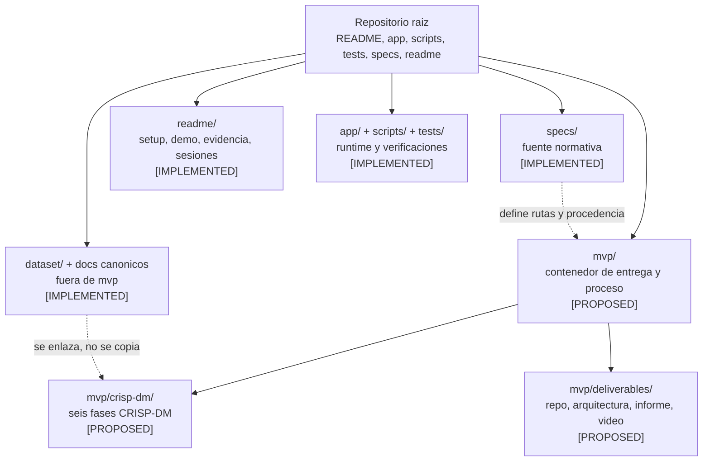
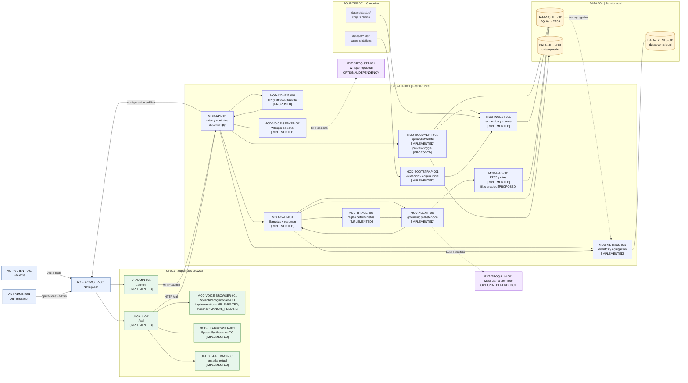
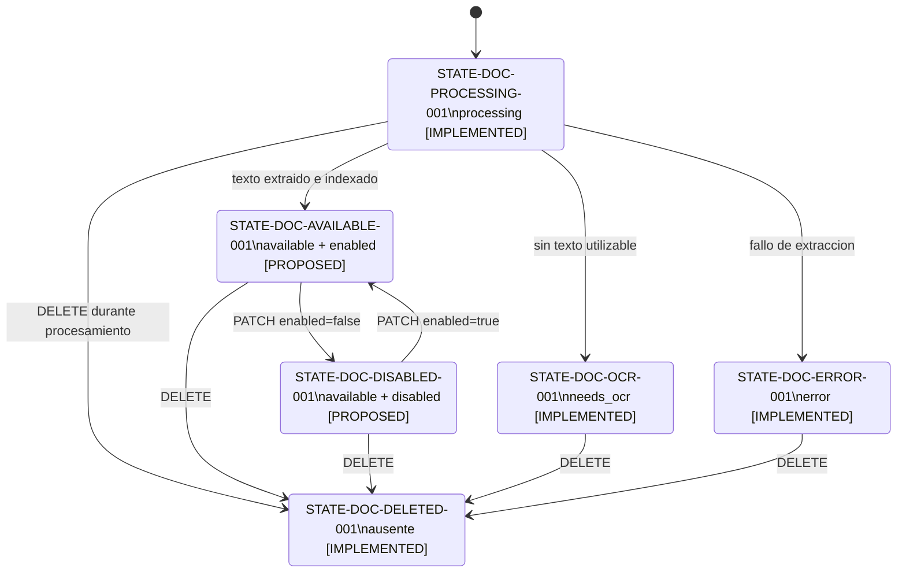
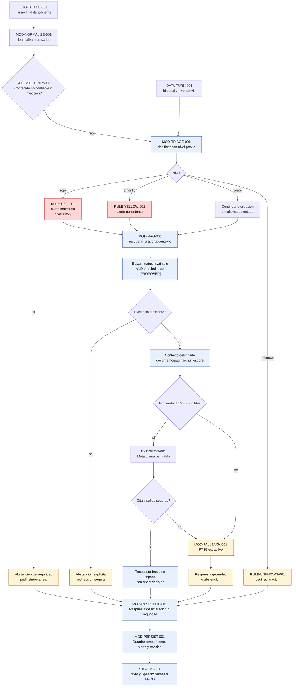
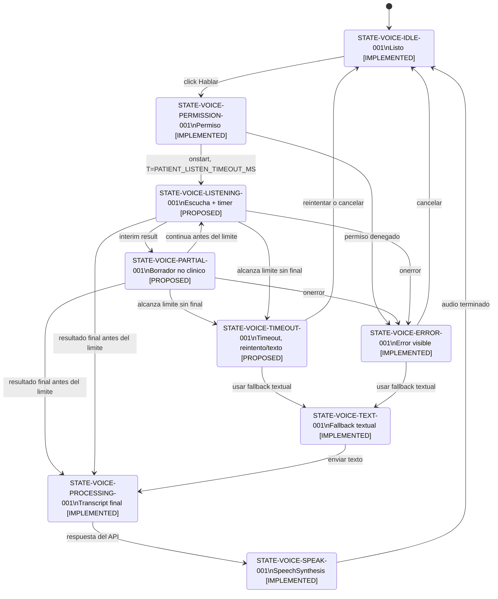
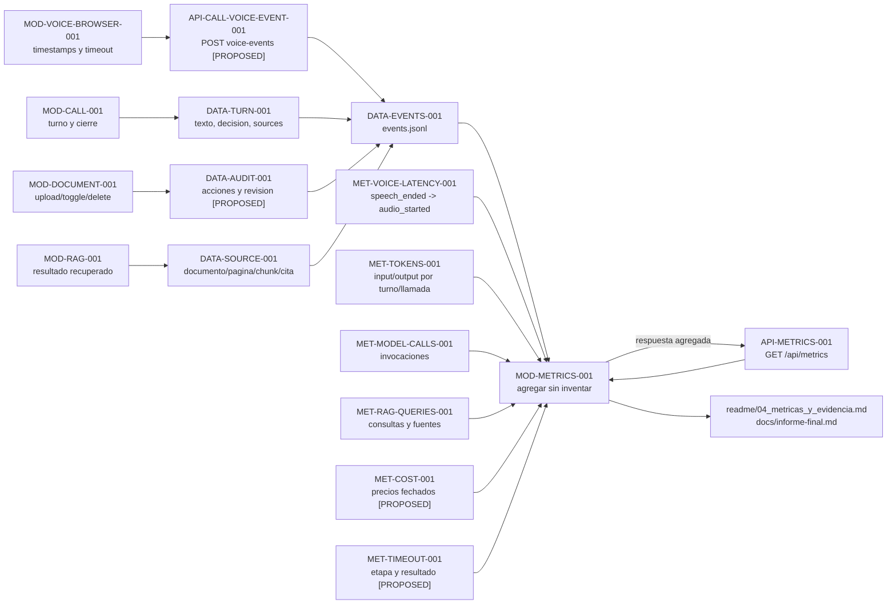

# Spec: Diagrama normativo del flujo completo del MVP

**Estado:** propuesta normativa para revision humana; no ejecutada ni implementada
**Version:** 0.1.0
**Fecha:** 2026-08-08
**Rol:** fuente principal del diagrama que guiara los cambios posteriores de codigo

## Objetivo

Definir una vista ASCII y un conjunto de subdiagramas Mermaid que cualquier persona pueda leer
para entender el sistema completo: actores, superficies, etapas, submodulos, persistencia,
conocimiento vivo, voz, triaje, RAG, fallbacks y metricas.

Este documento es el corazon de la implementacion posterior. No es una ilustracion libre: cada
bloque, estado y flecha normativa debe poder trazarse a una spec, un contrato, una ruta de
codigo y una verificacion. Los elementos que todavia no existen se marcan como `PROPOSED` y no
como implementados.

## Tech Stack

La vista se publica en Markdown con bloques `text` y `mermaid`, compatible con un renderizador
Mermaid moderno del repositorio o de GitHub. No agrega una libreria de runtime: el diagrama
documenta FastAPI/Uvicorn, SQLite/FTS5, Web Speech API, Groq opcional, fallback extractivo,
JSONL y las rutas de `mvp/` definidas por las specs upstream.

## Project Structure

- `specs/06_system_flow_diagram_specification.md`: fuente normativa y matriz `TRZ-*`.
- `docs/arquitectura.md`: vista publicada del baseline actual.
- `mvp/deliverables/02_architecture/`: vista formal futura, derivada con procedencia.
- `app/`, `scripts/`, `tests/`: rutas que cada modulo del diagrama debe poder localizar.
- `mvp/crisp-dm/`: fases de proceso futuras, sin copias de `dataset/` o `docs/`.

## Code Style

Los nodos usan IDs estables, etiquetas cortas y estado explicito. Las relaciones se rotulan con
direccion, tipo (`HTTP`, `DB`, `RAG`, `T=`) y contrato cuando cruzan un limite. Un nodo nuevo se
agrega primero a la tabla de modulos y a `TRZ-*`, antes de aparecer en Mermaid o en el codigo.

## Dependencias y precedencia

El diagrama se actualiza despues de las tres specs que cambian el alcance:

| ID | Fuente | Aporta al diagrama |
|---|---|---|
| `SPEC-BASE-001` | `specs/00_mvp_specification.md` | contrato del MVP, superficies, RAG, triaje y limites |
| `SPEC-STRUCT-001` | `specs/03_mvp_structure_specification.md` | ownership, rutas de entregables y fases `mvp/crisp-dm/` |
| `SPEC-ADMIN-001` | `specs/04_admin_document_lifecycle_specification.md` | preview, `enabled`, disable, enable, delete y filtro RAG |
| `SPEC-TIMEOUT-001` | `specs/05_patient_listening_timeout_specification.md` | `PATIENT_LISTEN_TIMEOUT_MS`, estados de escucha y fallback |
| `SPEC-RUBRIC-001` | `docs/rubrica-evaluacion.md` | G1-G5, voz, conocimiento vivo y metricas |
| `SPEC-STACK-001` | `docs/stack-tecnico.md` | familias de modelos permitidas |

Regla de precedencia:

```text
fuentes canonicas -> specs 00/03/04/05 -> esta spec 06 -> vistas publicadas -> codigo -> evidencia
```

Si la implementacion real contradice este documento, no se corrige el diagrama para esconder la
divergencia: se registra la diferencia, se actualiza primero la spec correspondiente y se marca
el elemento como `PROPOSED`, `MANUAL_PENDING` o `OUT_OF_SCOPE`.

## Convenciones visuales

### Prefijos de identificadores

| Prefijo | Elemento | Ejemplo |
|---|---|---|
| `ACT` | actor | `ACT-PATIENT-001` |
| `UI` | superficie de usuario | `UI-CALL-001` |
| `API` | ruta o contrato HTTP | `API-CALL-TURN-001` |
| `STG` | etapa del flujo | `STG-VOICE-001` |
| `MOD` | submodulo | `MOD-RAG-001` |
| `EXT` | dependencia externa | `EXT-GROQ-001` |
| `DATA` | persistencia o entidad | `DATA-SQLITE-001` |
| `STATE` | estado o transicion | `STATE-DOC-DISABLED-001` |
| `RULE` | regla de seguridad o decision | `RULE-TRIAGE-STICKY-001` |
| `MET` | metrica o evento | `MET-VOICE-P95-001` |
| `TRZ` | requisito trazable | `TRZ-RAG-CITATION-001` |
| `TEST` | prueba o evidencia | `TEST-LIVE-KNOWLEDGE-001` |
| `GATE` | compuerta del reto | `GATE-G5-001` |

### Estados de implementacion

Cada nodo o relacion se etiqueta con uno de estos estados. Cuando se necesiten dos dimensiones,
se escribe `implementation=...; evidence=...`; no se inventan estados nuevos como `PARTIAL` o
`TESTED local`.

- `IMPLEMENTED`: existe en el checkout y tiene ruta o contrato identificable.
- `TESTED`: ademas tiene prueba automatizada o evidencia reproducible.
- `MANUAL_PENDING`: existe, pero falta navegador, microfono, audio o demo real.
- `PROPOSED`: lo exige una spec futura, pero no existe aun en runtime.
- `OUT_OF_SCOPE`: se muestra para dejar claro el limite, pero no se implementara en el MVP.

`OPTIONAL` es un atributo de una dependencia externa, no un estado de implementacion. Por
ejemplo, el proveedor remoto puede ser `OPTIONAL; implementation=IMPLEMENTED; evidence=MANUAL_PENDING`.
Cuando un bloque mezcla baseline y extension, el estado se aplica al alcance indicado entre
parentesis, por ejemplo `IMPLEMENTED (preview/toggle PROPOSED)`.

### Lectura de flechas y bloques

- Flecha solida: flujo obligatorio del MVP.
- Flecha punteada: dependencia opcional, fallback o proveedor externo.
- Flecha roja en Mermaid: riesgo o regla que no puede degradarse.
- `HTTP`: limite de API entre navegador y FastAPI.
- `DB`: lectura o escritura persistente.
- `RAG`: consulta de conocimiento activo y cita.
- `T=`: timeout aplicable a la flecha.
- Los bloques `ACT`, `UI`, `MOD`, `DATA` y `EXT` no se mezclan: actor no es submodulo,
  navegador no decide triaje y proveedor no escribe directamente en persistencia.

### ID de cada vista

Las referencias `D1` a `D6` de la matriz significan:

| ID | Vista |
|---|---|
| `D1` | contexto, actores, bloques y estructura |
| `D2` | llamada completa del paciente |
| `D3` | administracion y conocimiento vivo |
| `D4` | triaje, RAG, agente y abstencion |
| `D5` | escucha, timeout y fallback |
| `D6` | datos, evidencia y metricas |

## Etapas de extremo a extremo

| Etapa | ID | Accion humana o tecnica | Salida observable |
|---|---|---|---|
| 0. Preparar | `STG-BOOT-001` | validar XLSX y recorrer corpus local | corpus inicial, hash y revision |
| 1. Administrar | `STG-ADMIN-001` | subir, previsualizar, habilitar, deshabilitar o borrar | inventario y estado visible |
| 2. Iniciar | `STG-CALL-001` | paciente abre `/call` y crea llamada | `call_id` y estado activo |
| 3. Escuchar | `STG-VOICE-001` | navegador captura voz o texto | transcript final o fallback |
| 4. Analizar | `STG-TRIAGE-001` | normalizar y clasificar con nivel previo | `rojo`, `amarillo`, `verde` o `unknown` |
| 5. Recuperar | `STG-RAG-001` | buscar solo `available + enabled` (extension propuesta) | chunks, score, pagina y cita |
| 6. Responder | `STG-AGENT-001` | LLM permitido o fallback extractivo | respuesta grounded o abstencion |
| 7. Hablar | `STG-TTS-001` | reproducir audio en `es-CO` | audio y timestamps |
| 8. Persistir | `STG-OBS-001` | guardar turno, fuente, alerta y metricas | SQLite, JSONL y `/api/metrics` |
| 9. Cerrar | `STG-CLOSE-001` | finalizar llamada | resumen estructurado y siguiente paso |

## Mermaid 0: ownership de estructura



Esta vista hace visible la dependencia de `SPEC-STRUCT-001`: `mvp/` contiene entregables, pero
no absorbe runtime, dataset ni documentos canonicos.

## Diagrama ASCII canonico

Este es el resumen humano obligatorio. Los subdiagramas Mermaid que siguen detallan sus
secciones; no pueden introducir un camino que contradiga este flujo.

```text
 ACT-ADMIN-001                                      ACT-PATIENT-001
 Administrador                                      Paciente
       |                                                  |
       | subir / preview / enable / disable / delete      | voz o texto
       v                                                  v
 +----------------------+                       +----------------------+
 | UI-ADMIN-001        |                       | UI-CALL-001         |
 | /admin              |                       | /call               |
 | [IMPLEMENTED]       |                       | [IMPLEMENTED]       |
 +----------+-----------+                       +----------+-----------+
            | HTTP ADMIN                                  | HTTP CALL
            +------------------+---------------------------+
                               v
                    +-------------------------+
                    | MOD-API-001             |
                    | FastAPI / Uvicorn       |
                    | [IMPLEMENTED]           |
                    +------------+------------+
                                 |
              +------------------+------------------+
              |                                     |
              v                                     v
 +--------------------------+             +--------------------------+
 | MOD-DOCUMENT-001        |             | MOD-CALL-001             |
  | upload/list/delete      |             | call/turn/finish         |
 | enable/disable/delete   |             | [IMPLEMENTED]            |
 | [IMPLEMENTED]           |             +------------+-------------+
 | preview/toggle [PROPOSED]|                          |
 +------------+-------------+                          |
              |                                        v
              v                            +--------------------------+
 +--------------------------+               | MOD-TRIAGE-001          |
 | MOD-INGEST-001          |               | rojo/amarillo/verde/    |
 | PDF/TXT/MD, paginas,    |               | unknown, alertas sticky |
 | chunks, needs_ocr       |               | [IMPLEMENTED]            |
 | [IMPLEMENTED]           |               +------------+-------------+
 +------------+-------------+                            |
              | paginas/chunks/FTS                       | decision
              +------------------+-------------------------+
                                 v
                    +-------------------------+
                    | MOD-RAG-001             |
                    | FTS5 + active filter    |
                    | chunks + citas          |
                    | [IMPLEMENTED]           |
                    | enabled filter [PROPOSED]|
                    +------------+------------+
                                 | contexto delimitado
                                 v
                    +-------------------------+
                    | MOD-AGENT-001           |
                    | respuesta grounded,     |
                    | abstencion y seguridad  |
                    | [IMPLEMENTED]           |
                    +------------+------------+
                                 |
                    +------------+------------+
                    |                         |
                    v                         v
          +-------------------+     +--------------------------+
          | EXT-GROQ-001      |     | MOD-FALLBACK-001         |
          | Llama permitido   |     | extractivo FTS5          |
          | Whisper opcional  |     | determinista             |
          | OPTIONAL DEPEND.  |     | [IMPLEMENTED]            |
          +-------------------+     +--------------------------+
                    |
                    v
          +--------------------------+
          | UI-CALL-001              |
          | SpeechSynthesis es-CO   |
          | [IMPLEMENTED]            |
          +------------+-------------+
                       |
                       v
          +--------------------------+
          | DATA-SQLITE-001          |
          | docs/pages/chunks/FTS5  |
          | calls/turns/sources      |
          | alerts/audit/revision    |
          +------------+-------------+
                       |
              +--------+--------+
              v                 v
    +----------------+  +----------------------+
    | DATA-FILES-001 |  | DATA-EVENTS-001     |
    | data/uploads   |  | data/events.jsonl   |
    +----------------+  +----------+-----------+
                                  |
                                  v
                       +----------------------+
                       | MOD-METRICS-001      |
                       | P50/P95, tokens,     |
                       | model calls, RAG,    |
                       | costo y timeouts     |
                       +----------------------+

 ESCUCHA (STG-VOICE-001)
   SpeechRecognition es-CO --> PATIENT_LISTEN_TIMEOUT_MS
   [PROPOSED]                 |-- timeout sin final: reintento/texto, nunca verde
                              |-- final antes del limite: un solo POST /turns
                              +-- navegador sin soporte: fallback textual

 RAG (STG-RAG-001)
   pregunta -> normalize -> status=available AND enabled=true [PROPOSED]
   -> FTS5 -> evidencia suficiente? -> cita o abstencion segura

 REGLAS NO NEGOCIABLES
    proveedor nunca decide triaje; LLM nunca baja rojo/amarillo;
    documento disabled/deleted nunca aparece en consultas nuevas;
    fuente historica no se reutiliza como evidencia nueva.
 ```

Lectura del retorno: `ACT-ADMIN-001` y `ACT-PATIENT-001` interactuan con
`ACT-BROWSER-001`; el navegador llama a `MOD-API-001`, y solo el API devuelve la respuesta a
`UI-CALL-001` para `SpeechSynthesis`. El bloque `EXT-GROQ-001` y `MOD-FALLBACK-001` convergen en
`MOD-AGENT-001`; ningun proveedor o navegador escribe directamente en `DATA-SQLITE-001`.
El bootstrap sigue el camino `dataset/ -> MOD-BOOTSTRAP-001 -> MOD-INGEST-001 -> SQLite/FTS5`
antes de la llamada. Los XLSX alimentan validacion y contratos de casos; no se inyectan como
corpus clinico ni se confunden con una conversacion completa.

## Mermaid 1: contexto, actores y bloques



### Lectura humana del diagrama 1

1. El paciente solo interactua con el navegador; el navegador no clasifica riesgo.
2. El administrador opera documentos desde `/admin`; el API coordina, pero no es una fuente
   clinica.
3. El agente combina triaje determinista, RAG y redaccion; el proveedor externo es opcional.
4. SQLite/FTS5 es el punto de verdad del conocimiento activo y de la trazabilidad.
5. `CFG` es `PROPOSED` hasta que exista la variable y el timer de escucha.

## Mermaid 2: etapas de una llamada del paciente

```mermaid
sequenceDiagram
    actor PAT as ACT-PATIENT-001
    participant BR as ACT-BROWSER-001
    participant API as MOD-API-001
    participant CFG as MOD-CONFIG-001
    participant VOICE as MOD-VOICE-BROWSER-001
    participant CALL as MOD-CALL-001
    participant TRI as MOD-TRIAGE-001
    participant RAG as MOD-RAG-001
    participant AG as MOD-AGENT-001
    participant LLM as EXT-GROQ-LLM-001
    participant STT as EXT-GROQ-STT-001
    participant DB as DATA-SQLITE-001
    participant MET as MOD-METRICS-001

    PAT->>BR: Abrir /call y completar contexto
    BR->>API: POST /api/calls
    API->>CALL: start_call()
    CALL->>DB: crear call active
    DB-->>CALL: call_id
    API-->>BR: llamada activa

    loop Cada turno
        PAT->>BR: Pulsar Hablar y responder
        BR->>API: GET /health, timeout publico [PROPOSED]
        API->>CFG: leer timeout publico
        CFG-->>API: patient_listen_timeout_ms
        API-->>BR: limite efectivo [PROPOSED]

        alt Browser SpeechRecognition disponible
            BR->>VOICE: iniciar SpeechRecognition es-CO
        else Audio hacia Whisper opcional
            BR->>API: POST /api/calls/{id}/audio
            API->>STT: Whisper, T=30s
            STT-->>API: transcript o error
        end

        alt transcript final antes del limite
            VOICE-->>BR: texto final
            BR->>API: POST /api/calls/{id}/turns
        else timeout sin transcript final
            VOICE-->>BR: cancelar escucha [PROPOSED]
            BR-->>PAT: Reintentar o usar texto; no respuesta clinica
            BR->>API: POST /api/calls/{id}/voice-events [PROPOSED]
            API->>MET: guardar patient_listen_timeout
        else navegador sin soporte o permiso denegado
            VOICE-->>BR: error visible
            BR-->>PAT: Fallback textual
        end

        API->>CALL: handle_turn(text)
        CALL->>TRI: normalize + classify(text, previous_level)
        TRI-->>CALL: level, triggers, alert, clarify
        CALL->>DB: guardar turno de paciente
        CALL->>AG: responder(text, triage, history)
        AG->>RAG: search(text, active corpus)
        RAG->>DB: FTS5 WHERE status=available AND enabled=1 [PROPOSED]
        DB-->>RAG: chunks, score, page, corpus_revision
        RAG-->>AG: fuentes y citas

        alt evidencia suficiente y proveedor disponible
            AG->>LLM: Llama permitido, T=12s
            LLM-->>AG: respuesta candidata
            AG->>AG: validar cita y seguridad
        else proveedor caido, timeout o respuesta insegura
            AG->>AG: fallback extractivo o abstencion
        end

        AG-->>CALL: respuesta, fuentes, decision y metricas
        CALL->>DB: guardar turno, fuentes y alerta
        CALL->>MET: registrar turn y rag event
        MET->>MET: escribir events.jsonl
        API-->>BR: texto, fuentes y decision
        BR->>BR: SpeechSynthesis es-CO
        BR->>API: voice-timing speech_ended/audio_started
    end

    PAT->>BR: Finalizar llamada
    BR->>API: POST /api/calls/{id}/finish
    API->>CALL: cerrar y resumir
    CALL->>DB: resumen, next_steps, estado closed
    API-->>BR: resumen estructurado
```

## Mermaid 3: administracion y conocimiento vivo

```mermaid
sequenceDiagram
    actor ADM as ACT-ADMIN-001
    participant BR as ACT-BROWSER-001
    participant API as MOD-API-001
    participant DOC as MOD-DOCUMENT-001
    participant ING as MOD-INGEST-001
    participant DB as DATA-SQLITE-001
    participant FS as DATA-FILES-001
    participant RAG as MOD-RAG-001

    ADM->>BR: Abrir /admin
    BR->>API: GET /api/admin/documents
    API->>DOC: list()
    DOC->>DB: documentos, estados y revision
    DB-->>API: status, enabled, rag_eligible, counts [PROPOSED fields]
    API-->>BR: status, enabled, rag_eligible, counts [PROPOSED fields]

    ADM->>BR: Subir PDF, TXT o MD
    BR->>API: POST /api/admin/documents
    API->>DOC: validar extension, tamano y SHA-256
    DOC->>FS: guardar original
    DOC->>ING: extraer paginas y generar chunks
    ING->>DB: paginas, chunks y FTS5
    DOC->>DB: available, needs_ocr o error
    API-->>BR: estado visible sin reiniciar

    ADM->>BR: Abrir preview de pagina [PROPOSED]
    BR->>API: GET /api/admin/documents/{id}/preview [PROPOSED]
    API->>DB: leer pages.text, limite <= 8000 [PROPOSED]
    DB-->>API: texto no ejecutable o reason=needs_ocr [PROPOSED]
    API-->>BR: texto no ejecutable o reason=needs_ocr [PROPOSED]

    ADM->>BR: Deshabilitar documento [PROPOSED]
    BR->>API: PATCH /api/admin/documents/{id} enabled=false [PROPOSED]
    API->>DOC: set_enabled(false)
    DOC->>DB: enabled=0, revision y auditoria
    DB-->>API: rag_eligible=false [PROPOSED]
    API-->>BR: rag_eligible=false [PROPOSED]
    RAG->>DB: nueva consulta con filtro enabled=1
    DB-->>RAG: fuente deshabilitada excluida

    ADM->>BR: Habilitar documento [PROPOSED]
    BR->>API: PATCH /api/admin/documents/{id} enabled=true [PROPOSED]
    API->>DOC: set_enabled(true)
    DOC->>DB: enabled=1, revision y auditoria
    DB-->>API: rag_eligible=true [PROPOSED]
    API-->>BR: rag_eligible=true [PROPOSED]
    RAG->>DB: nueva consulta con filtro enabled=1
    DB-->>RAG: fuente recuperable sin reingesta

    ADM->>BR: Eliminar documento
    BR->>API: DELETE /api/admin/documents/{id}
    API->>DOC: delete(id)
    DOC->>DB: borrar paginas, chunks, FTS5 y documento
    DOC->>DB: revision y auditoria delete
    DOC->>FS: eliminar original despues de commit
    API-->>BR: deleted=true
    RAG->>DB: nueva consulta
    DB-->>RAG: fuente ausente; abstencion si era la unica evidencia
```



## Mermaid 4: triaje, RAG, agente y abstencion



Reglas que el codigo debe conservar:

- `rojo` nunca baja a otro nivel.
- `amarillo` no puede ser eliminado por una respuesta del LLM.
- `unknown` pide aclaracion y no cierra la decision.
- El LLM redacta; el triaje determinista decide el nivel.
- Ningun documento o paciente puede convertir contexto no confiable en instruccion del sistema.
- Sin evidencia actual hay abstencion, no una respuesta clinica inventada.
- Un timeout de proveedor conserva la decision de triaje y usa fallback o abstencion.

## Mermaid 5: escucha y timeout



El timeout no es el mismo camino que el silencio natural de `SpeechRecognition`. La semantica
provisional es un limite total; si se aprueba un limite de silencio, esta vista debe cambiar
junto con `specs/05_patient_listening_timeout_specification.md`. El default propuesto es
`PATIENT_LISTEN_TIMEOUT_MS=30000`, con rango `1000..300000`; un timeout sin transcript final
termina en reintento/texto y nunca en `verde`.

## Mermaid 6: datos, evidencia y metricas



Campos minimos de un evento conversacional:

```text
event_type, created_at, call_id, turn_id, listen_id, client_turn_id, speech_ended_at, audio_started_at,
latency_ms, input_tokens, output_tokens, model_calls, rag_queries, source_ids,
model_version, provider, fallback_reason, timeout_stage, configured_timeout_ms
```

Si faltan timestamps de voz, P50/P95 queda ausente. No se extrapola desde una prueba textual
ni desde un mock.

## Contratos y mapa de submodulos

| ID | Entrada | Salida | Ruta actual o futura | Estado |
|---|---|---|---|---|
| `MOD-API-001` | HTTP JSON/multipart | respuestas HTTP | `app/main.py` | IMPLEMENTED |
| `MOD-CONFIG-001` | entorno | limites y timeout publico | `app/config.py` | PROPOSED para paciente |
| `MOD-DOCUMENT-001` | bytes, id y toggle | inventario, estados y revision | `app/services/documents.py` | IMPLEMENTED; preview/toggle PROPOSED |
| `MOD-INGEST-001` | PDF/TXT/MD | paginas y chunks | `app/services/ingestion.py` | IMPLEMENTED |
| `MOD-CALL-001` | turnos y cierre | respuestas y resumen | `app/services/calls.py` | IMPLEMENTED |
| `MOD-NORMALIZE-001` | transcript | texto normalizado | `app/services/triage.py`, `app/services/agent.py` | IMPLEMENTED |
| `MOD-TRIAGE-001` | texto y nivel previo | nivel, triggers y alerta | `app/services/triage.py` | IMPLEMENTED |
| `MOD-RAG-001` | pregunta | chunks y citas | `app/services/rag.py` | IMPLEMENTED; filtro enabled PROPOSED |
| `MOD-AGENT-001` | contexto, triaje e historia | respuesta o abstencion | `app/services/agent.py` | IMPLEMENTED |
| `MOD-RESPONSE-001` | decision y evidencia | texto seguro para paciente | `app/services/agent.py`, `app/services/calls.py` | IMPLEMENTED |
| `MOD-PERSIST-001` | turno, fuentes y alerta | filas y revision | `app/database.py`, `app/services/calls.py` | IMPLEMENTED |
| `MOD-VOICE-BROWSER-001` | microfono | transcript | `app/web/app.js` | IMPLEMENTED; timer PROPOSED |
| `MOD-VOICE-SERVER-001` | audio | transcript Whisper | `app/services/voice.py` | IMPLEMENTED |
| `MOD-TTS-BROWSER-001` | texto | audio `es-CO` | `app/web/app.js` | IMPLEMENTED |
| `MOD-METRICS-001` | eventos | agregados y JSONL | `app/services/metrics.py` | IMPLEMENTED |
| `MOD-BOOTSTRAP-001` | dataset local | corpus inicial | `app/bootstrap.py`, `app/dataset.py`, `scripts/bootstrap.py` | IMPLEMENTED |

### Contratos HTTP visibles

| ID | Metodo/ruta | Uso | Estado |
|---|---|---|---|
| `API-ADMIN-PAGE-001` | `GET /admin` | consola | IMPLEMENTED |
| `API-ADMIN-LIST-001` | `GET /api/admin/documents` | inventario | IMPLEMENTED |
| `API-ADMIN-UPLOAD-001` | `POST /api/admin/documents` | ingesta | IMPLEMENTED |
| `API-ADMIN-PREVIEW-001` | `GET /api/admin/documents/{id}/preview` | preview humana | PROPOSED |
| `API-ADMIN-TOGGLE-001` | `PATCH /api/admin/documents/{id}` | enable/disable | PROPOSED |
| `API-ADMIN-DELETE-001` | `DELETE /api/admin/documents/{id}` | borrar y olvidar | IMPLEMENTED |
| `API-CALL-PAGE-001` | `GET /call` | llamada | IMPLEMENTED |
| `API-CALL-START-001` | `POST /api/calls` | iniciar | IMPLEMENTED |
| `API-CALL-TURN-001` | `POST /api/calls/{id}/turns` | responder turno | IMPLEMENTED |
| `API-CALL-AUDIO-001` | `POST /api/calls/{id}/audio` | STT opcional | IMPLEMENTED |
| `API-CALL-TIMING-001` | `POST /api/calls/{id}/turns/{turn_id}/voice-timing` | latencia | IMPLEMENTED |
| `API-CALL-VOICE-EVENT-001` | `POST /api/calls/{id}/voice-events` | estados de escucha | PROPOSED |
| `API-CONFIG-PUBLIC-001` | `GET /health` con `patient_listen_timeout_ms` | timeout publico | PROPOSED |
| `API-CALL-FINISH-001` | `POST /api/calls/{id}/finish` | cierre | IMPLEMENTED |
| `API-METRICS-001` | `GET /api/metrics` | metricas | IMPLEMENTED |

## Matriz de trazabilidad

| ID | Requisito observable | Diagrama | Spec origen | Codigo/contrato | Verificacion | Estado |
|---|---|---|---|---|---|---|
| `TRZ-ACTORS-001` | paciente, admin, browser y proveedor diferenciados | D1, D2, D3 | 00, rubrica | `app/web/`, `app/main.py` | revision + smoke | IMPLEMENTED |
| `TRZ-SURFACES-001` | `/admin` y `/call` accesibles | D1, D2 | 00 | `app/main.py` | `tests/test_api.py` | TESTED |
| `TRZ-STRUCTURE-001` | entregables bajo `mvp/` y fases bajo `mvp/crisp-dm/` | D1 | 03 | indices y manifiestos | revision de rutas | PROPOSED |
| `TRZ-ADMIN-PREVIEW-001` | texto extraido visible y seguro | D3 | 04 | preview API/UI | test preview + manual | PROPOSED |
| `TRZ-ADMIN-TOGGLE-001` | disable excluye RAG y enable recupera | D3, D4 | 04 | `enabled`, filtro RAG | test toggle | PROPOSED |
| `TRZ-ADMIN-DELETE-001` | delete elimina conocimiento futuro | D3, D4 | 00, 04, G5 | `DocumentService.delete` | live knowledge | TESTED |
| `TRZ-RAG-ACTIVE-001` | RAG usa solo `available + enabled` | D1, D3, D4 | 04 | `RagService.search` | test filtro | PROPOSED |
| `TRZ-CITATION-001` | respuesta grounded conserva pagina/chunk/cita | D2, D4, D6 | 00 | `SearchResult`, `sources` | agent/calls tests | TESTED |
| `TRZ-HISTORY-001` | nivel previo y fuentes historicas no se mezclan con evidencia nueva | D2, D4, D6 | 00, 04 | historial de llamada y `corpus_revision` | calls/RAG tests | PROPOSED |
| `TRZ-VOICE-TIMEOUT-001` | escucha configurable y fallback visible | D2, D5 | 05 | config + `app.js` | config + browser | PROPOSED |
| `TRZ-TRIAGE-001` | rojo, amarillo, verde y unknown | D2, D4 | 00, rubrica | `triage.py` | `tests/test_triage.py` | TESTED |
| `TRZ-STICKY-001` | rojo y amarillo no degradan | D4 | 00 | `highest_level` | triage/calls tests | TESTED |
| `TRZ-ABSTAIN-001` | sin evidencia produce abstencion | D4 | 00 | `agent.py` | agent tests | TESTED |
| `TRZ-PERSIST-001` | turnos, fuentes, alertas y resumen persisten | D2, D6 | 00 | `database.py`, `calls.py` | calls/API tests | TESTED |
| `TRZ-METRICS-001` | latencia, tokens, calls y RAG trazables | D2, D6 | rubrica | `metrics.py`, JSONL | metrics tests + demo | TESTED |
| `TRZ-COST-001` | costo por llamada con precios fechados | D6 | rubrica | informe + agregador | evidencia de proveedor | PROPOSED |
| `TRZ-VOICE-IDEMP-001` | un transcript final no duplica intercambio | D2, D5 | 05 | `client_turn_id` y API | prueba de carrera | PROPOSED |
| `TRZ-CONFIG-PUBLIC-001` | timeout efectivo llega al browser sin secreto | D2, D5 | 05 | `/health` | prueba API + browser | PROPOSED |
| `TRZ-TIMEOUT-SEPARATION-001` | escucha no cambia Groq, Whisper ni SQLite | D2, D5 | 05 | config y adaptadores | pruebas de configuracion | PROPOSED |
| `TRZ-ADMIN-LOCAL-001` | admin permanece local sin autenticacion | D1, D3 | 04 | bind y setup | preflight de URL | PROPOSED |
| `TRZ-MODEL-001` | proveedor y modelo pertenecen a familia permitida | D1, D2, D4 | stack, G3 | `GROQ_MODEL`, informe | health + revision | TESTED |
| `TRZ-BOOTSTRAP-001` | XLSX se valida y corpus alimenta SQLite sin alterar fuentes | D1, D6 | 00 | `app.bootstrap`, `scripts.validate_dataset`, dataset | validador + bootstrap | TESTED |
| `TRZ-G4-001` | ida y vuelta de voz real | D2, D5 | G4 | browser | smoke manual | MANUAL_PENDING |
| `TRZ-G5-001` | aprender, usar, borrar y olvidar | D3, D4 | G5 | admin + RAG | test + demo externa | MANUAL_PENDING |

## Reglas de sincronizacion con cambios

La spec del diagrama debe revisarse antes de aceptar codigo cuando cambie cualquiera de estos
elementos:

1. **Estructura:** cambiar una ruta bajo `mvp/`, `app/`, `specs/` o `readme/` exige actualizar
   el mapa de ownership, enlaces y manifiestos de `03`.
2. **Administracion:** agregar preview, enable o disable exige actualizar D1, D3, D4, la
   maquina de estados, `enabled`, `rag_eligible`, `corpus_revision` y G5 en la matriz.
3. **Timeout:** cambiar la semantica o default exige actualizar D2, D5, eventos de metricas,
   `.env.example`, setup y la definicion de P50/P95.
4. **Modelo:** cambiar proveedor o version exige actualizar D1, D2, informe, `health`, costo y
   G3; solo se permiten familias de `docs/stack-tecnico.md`.
5. **Ruta o modulo:** toda flecha entre submodulos debe corresponder a una funcion, endpoint,
   tabla o prueba. Si es futura, se marca `PROPOSED`.
6. **Estado:** nunca cambiar `PROPOSED` a `IMPLEMENTED` sin evidencia; los tests automatizados
   no sustituyen G4 ni la demo externa de G5.
7. **Vista publicada:** `docs/arquitectura.md` y el paquete bajo `mvp/deliverables/` deben
   enlazar esta spec y registrar version, fecha y commit de la copia publicada.

### Protocolo de actualizacion

```text
1. Cambiar la spec de alcance afectada (03, 04 o 05).
2. Registrar la decision y sus preguntas abiertas.
3. Actualizar esta spec 06 y su matriz TRZ.
4. Actualizar docs/arquitectura.md, README, fases y entrega bajo mvp/.
5. Implementar solo despues de que el diagrama y los contratos coincidan.
6. Ejecutar pruebas enfocadas y luego preflight completo.
7. Registrar evidencia con fecha, commit y resultado.
```

## Comandos de verificacion previstos

No se ejecutan en esta sesion. Cuando exista implementacion, el orden previsto es:

```text
python -m pytest tests/test_api.py tests/test_live_knowledge.py -q
python -m pytest tests/test_triage.py tests/test_calls.py tests/test_metrics.py -q
python -m scripts.validate_dataset
python -m app.bootstrap --data-dir <temp>
python -m pytest -q --basetemp <temp>
ruff check .
```

La verificacion documental debe comprobar manualmente que cada ID `TRZ-*` tiene spec, ruta de
codigo o contrato, prueba y estado. No se requiere renderizar Mermaid para aprobar la sintaxis
de la spec, pero una revision humana debe confirmar que los diagramas son legibles.

## Estrategia de pruebas

- **Revision humana:** actores, limites, etapas y convenciones se entienden sin leer codigo.
- **Trazabilidad:** cada nodo normativo tiene ID, fuente, ruta y evidencia.
- **Contrato:** endpoints actuales y propuestos coinciden con las specs upstream.
- **Flujo clinico:** triaje rojo/amarillo/verde/unknown, abstencion y no degradacion.
- **Conocimiento vivo:** upload, preview, disable, enable, delete y olvido sin reinicio.
- **Voz:** timeout, permiso, resultado parcial, resultado final, audio y fallback textual.
- **Observabilidad:** nombres de campos coinciden con `/api/metrics` y `events.jsonl`.
- **Regresion:** la vista no declara implementado lo que el baseline aun marca pendiente.

## Limites

- **Siempre:** mantener ASCII legible en la vista principal, IDs estables, estado visible,
  separacion entre actor/browser/agente/proveedor, filtro RAG explicito y citas trazables.
- **Preguntar antes:** cambiar el modelo, sacar el admin de localhost, introducir streaming
  full-duplex, cambiar la semantica del timeout, agregar OCR o cambiar ownership de fuentes.
- **Nunca:** dibujar una funcionalidad no especificada como terminada, permitir que el proveedor
  decida triaje, mostrar documentos deshabilitados como activos, copiar `dataset/` o `docs/`,
  inventar metricas o citar una fuente borrada en una respuesta nueva.

## Criterios de exito

- **DGM-AC-01:** existe un ASCII canonico legible desde el actor hasta la persistencia y el RAG.
- **DGM-AC-02:** existen subdiagramas Mermaid para contexto, llamada, admin, estados de
  documentos, triaje/RAG, voz/timeout y metricas.
- **DGM-AC-03:** cada diagrama distingue actores, superficies, submodulos, datos y externos.
- **DGM-AC-04:** el flujo incluye las etapas de bootstrap, admin, llamada, escucha, triaje,
  RAG, respuesta, audio, persistencia y cierre.
- **DGM-AC-05:** el RAG muestra explicitamente `status=available AND enabled=true`, citas y
  abstencion.
- **DGM-AC-06:** el flujo muestra `rojo`, `amarillo`, `verde` y `unknown` con reglas sticky.
- **DGM-AC-07:** el flujo muestra preview, enable, disable y delete, y marca las capacidades
  futuras como `PROPOSED`.
- **DGM-AC-08:** el flujo muestra `PATIENT_LISTEN_TIMEOUT_MS`, sus consecuencias seguras y la
  separacion respecto a Groq, Whisper y SQLite.
- **DGM-AC-09:** existe matriz `TRZ-*` con spec, codigo/contrato, prueba y estado.
- **DGM-AC-10:** un cambio en specs 03, 04 o 05 tiene una regla explicita para reflejarse en
  este documento, las vistas publicadas y luego el codigo.
- **DGM-AC-11:** no se afirma que la spec haya sido ejecutada ni que las capacidades propuestas
  hayan sido implementadas.

## Vistas publicadas y preguntas abiertas

La vista de implementacion actual esta en [`docs/arquitectura.md`](../docs/arquitectura.md).
Mientras esta spec no sea aprobada, ese documento describe el baseline actual y no se reemplaza
silenciosamente. Una vez aprobada, `docs/arquitectura.md` y la vista bajo
`mvp/deliverables/02_architecture/` deben enlazar la version de esta spec que publican.

Preguntas abiertas:

1. Confirmar el ownership final entre la spec normativa, `docs/arquitectura.md` y la vista bajo
   `mvp/deliverables/`.
2. Confirmar si el timeout debe ser total, de silencio o una combinacion de ambos.
3. Confirmar si la preview de texto extraido satisface el entregable o se requiere render PDF.
4. Confirmar si las cargas nuevas quedan habilitadas o en cuarentena.
5. Confirmar si el video vive bajo `mvp/` como archivo o como referencia externa.
