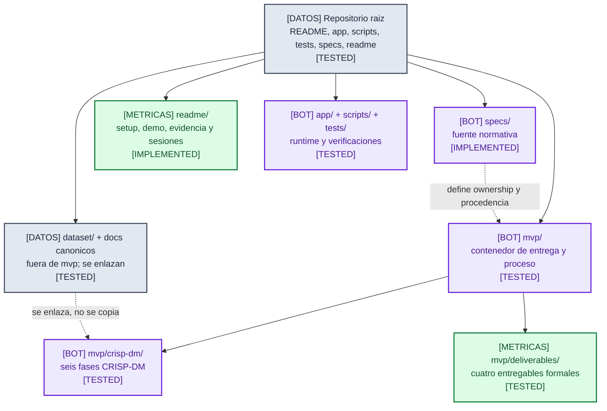
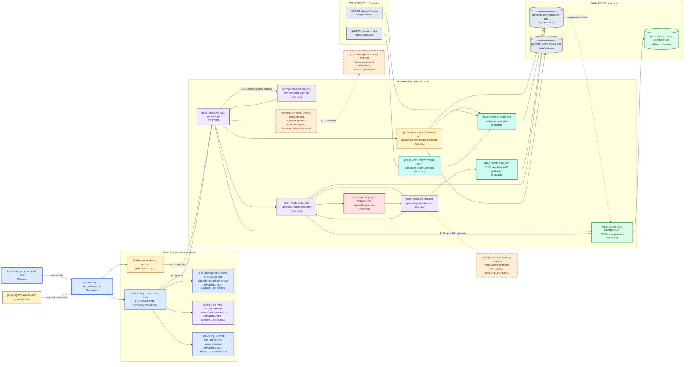
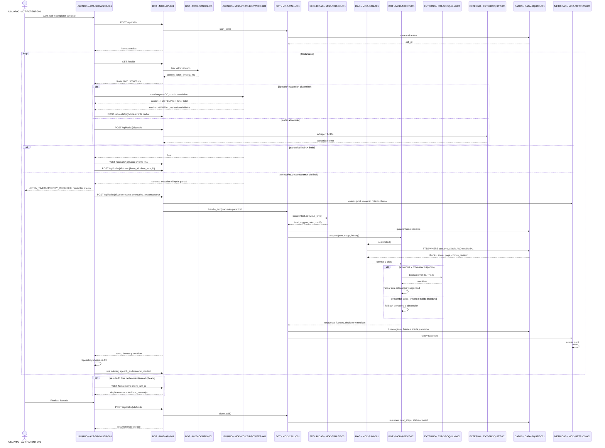
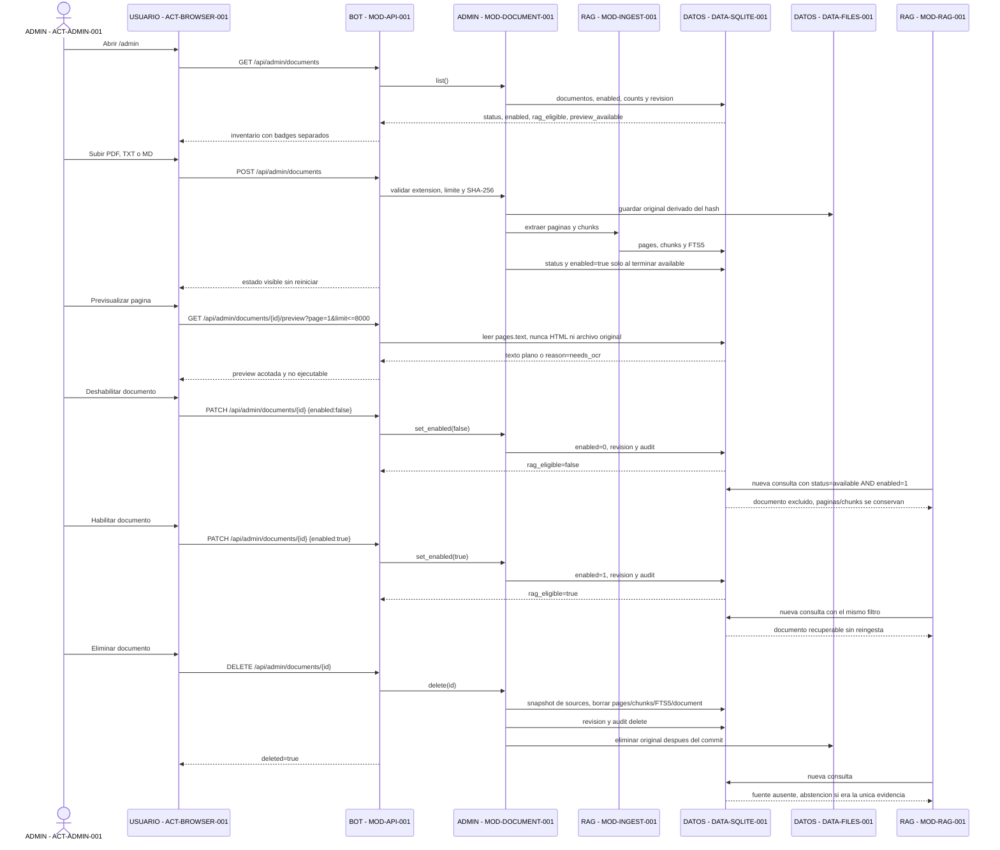
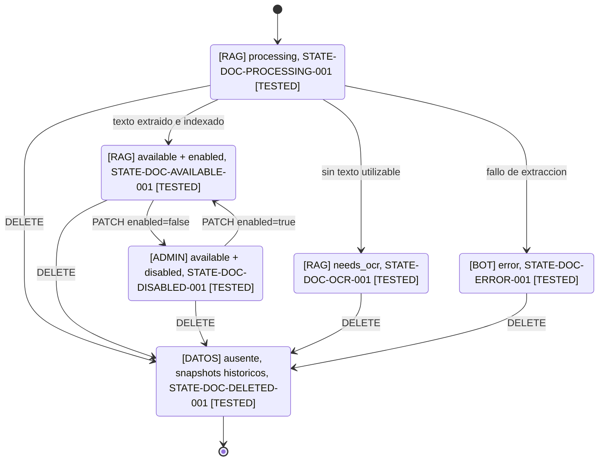
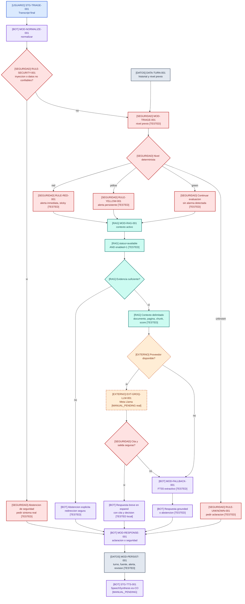
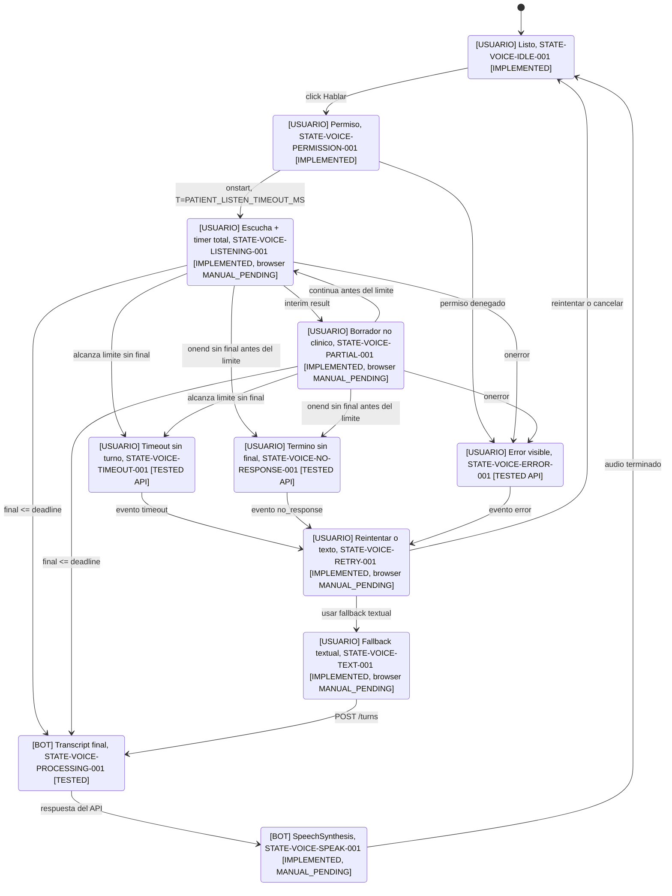
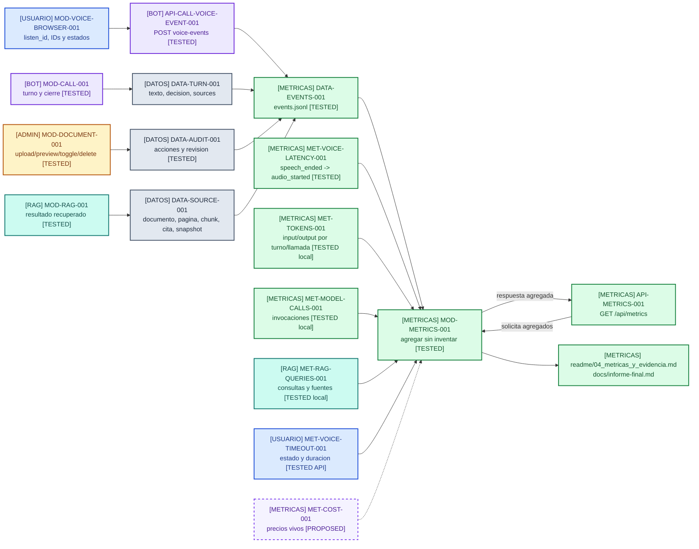

# Spec: Diagrama integrador del flujo completo del MVP

**Estado:** integrada; sintaxis y contrato visual corregidos; runtime y pruebas locales verificadas; evidencia manual pendiente
**Version:** 0.3.0
**Fecha:** 2026-08-08
**Rol:** fuente normativa del diagrama y de la trazabilidad de las specs 03, 04 y 05

## Objetivo

Definir la vista ASCII y los subdiagramas Mermaid del MVP que ya existe en el checkout. La vista
integra estructura, administracion documental, llamada browser/API, escucha, triaje, RAG,
respuesta, persistencia y metricas. No es una ilustracion libre: cada bloque y cada limite
importante tiene una spec de origen, una ruta de codigo o contrato y una verificacion local o
manual explicitamente clasificada.

La fuente normativa de requisitos sigue siendo `specs/00_mvp_specification.md` y las specs 03,
04 y 05 aportan respectivamente estructura, ciclo documental y timeout. Esta spec no modifica el
runtime; sincroniza su vista integradora y deja visibles las divergencias y los pendientes de
evidencia.

## Precedencia y fuentes

| ID | Fuente | Aporte al diagrama |
|---|---|---|
| `SPEC-BASE-001` | [`specs/00_mvp_specification.md`](00_mvp_specification.md) | contrato del MVP, superficies, RAG, triaje y limites |
| `SPEC-STRUCT-001` | [`specs/03_mvp_structure_specification.md`](03_mvp_structure_specification.md) | ownership aplicado, `mvp/crisp-dm/` y `mvp/deliverables/` |
| `SPEC-ADMIN-001` | [`specs/04_admin_document_lifecycle_specification.md`](04_admin_document_lifecycle_specification.md) | preview textual, `enabled`, `rag_eligible`, toggle, delete y snapshots |
| `SPEC-TIMEOUT-001` | [`specs/05_patient_listening_timeout_specification.md`](05_patient_listening_timeout_specification.md) | `PATIENT_LISTEN_TIMEOUT_MS`, estados, IDs, eventos e idempotencia |
| `SPEC-TEST-001` | [`specs/07_testing_unit_integration_specification.md`](07_testing_unit_integration_specification.md) | frontera entre pruebas locales y evidencia manual; estrategia ejecutable |
| `SPEC-ADMIN-UX-001` | [`specs/08_admin_inventory_ux_specification.md`](08_admin_inventory_ux_specification.md) | inventario full-width, responsive y sin SHA visible; propuesta futura |
| `SPEC-ADMIN-SOURCE-001` | [`specs/09_admin_source_preview_specification.md`](09_admin_source_preview_specification.md) | archivo original en modal y separacion de texto extraido; propuesta futura |
| `SPEC-ARCH-EXPLORER-001` | [`specs/10_architecture_explorer_specification.md`](10_architecture_explorer_specification.md) | vista HTML navegable derivada; no agrega autoridad |
| `SPEC-UX-COPY-001` | [`specs/11_conversational_ux_writing_specification.md`](11_conversational_ux_writing_specification.md) | mensajes de voz/UI, contencion y separacion de canales; propuesta futura |
| `SPEC-RUBRIC-001` | [`docs/rubrica-evaluacion.md`](../docs/rubrica-evaluacion.md) | gates G1-G5 y metricas obligatorias |
| `SPEC-STACK-001` | [`docs/stack-tecnico.md`](../docs/stack-tecnico.md) | familias de modelos permitidas |

La precedencia operativa es:

```text
fuentes canonicas -> specs 00/03/04/05 -> spec 06 -> vistas publicadas -> codigo -> evidencia
```

Si una vista publicada o el codigo contradicen una spec, se registra la divergencia y su fuente
responsable. `PROPOSED` no se usa para ocultar una capacidad que ya existe o una discrepancia.

## Estados de implementacion y evidencia

Los estados se aplican al alcance indicado. Cuando una capacidad tiene codigo pero carece de una
prueba que requiera navegador o proveedor, se conserva la dimension separada.

| Estado | Significado |
|---|---|
| `IMPLEMENTED` | existe en el checkout y tiene ruta o contrato identificable |
| `TESTED` | existe y tiene una prueba automatizada o una comprobacion reproducible ejecutada |
| `MANUAL_PENDING` | existe, pero falta navegador, microfono, audio, proveedor real, cronometraje o documento externo |
| `PROPOSED` | capacidad futura que no existe en el runtime actual |
| `OUT_OF_SCOPE` | limite explicito del MVP; no se implementa en este corte |

`DIVERGENCE` es una anotacion de sincronizacion, no un estado adicional. Se documenta en la
seccion [Divergencias conocidas](#divergencias-conocidas) con la fuente que debe resolverla.

## Convenciones visuales

### Prefijos de identificadores

| Prefijo | Elemento | Ejemplo |
|---|---|---|
| `ACT` | actor | `ACT-PATIENT-001` |
| `UI` | superficie browser | `UI-CALL-001` |
| `API` | ruta o contrato HTTP | `API-CALL-TURN-001` |
| `STG` | etapa | `STG-VOICE-001` |
| `MOD` | submodulo | `MOD-RAG-001` |
| `EXT` | dependencia externa | `EXT-GROQ-LLM-001` |
| `DATA` | persistencia o entidad | `DATA-SQLITE-001` |
| `STATE` | estado o transicion | `STATE-DOC-DISABLED-001` |
| `RULE` | regla de seguridad | `RULE-TRIAGE-STICKY-001` |
| `MET` | metrica o evento | `MET-VOICE-TIMEOUT-001` |
| `TRZ` | requisito trazable | `TRZ-RAG-CITATION-001` |
| `TEST` | prueba o evidencia | `TEST-TIMEOUT-001` |
| `GATE` | compuerta del reto | `GATE-G5-001` |

Las flechas que cruzan navegador/API llevan `HTTP`; las de persistencia, `DB`; las de
recuperacion, `RAG`; y las que tienen un limite temporal, `T=`. La tabla de
[contratos](#mapa-de-contratos-y-submodulos) y la matriz `TRZ-*` son la autoridad para localizar
cada flecha.

### Contrato visual y compatibilidad Mermaid

Los diagramas deben ayudar a una persona a entender ownership y responsabilidad antes de leer
codigo. El color no es un estado clinico ni una prueba de seguridad: es una segunda señal de quien
opera o posee cada bloque. Todo color debe acompanarse con una etiqueta textual entre corchetes.

| Ownership | Fondo | Borde | Etiqueta obligatoria |
|---|---|---|---|
| Usuario/paciente | `#DBEAFE` | `#1D4ED8` | `[USUARIO]` |
| Administrador | `#FEF3C7` | `#B45309` | `[ADMIN]` |
| Bot/aplicacion | `#EDE9FE` | `#6D28D9` | `[BOT]` |
| RAG/conocimiento | `#CCFBF1` | `#0F766E` | `[RAG]` |
| Datos/persistencia | `#E2E8F0` | `#475569` | `[DATOS]` |
| Externo/proveedor | `#FFEDD5` | `#C2410C` | `[EXTERNO]` |
| Seguridad/triage | `#FEE2E2` | `#B91C1C` | `[SEGURIDAD]` |
| Metricas/evidencia | `#DCFCE7` | `#15803D` | `[METRICAS]` |
| Futuro o pendiente | `#F5F3FF` | `#7C3AED` discontinuo | `[PROPOSED]` o `[MANUAL_PENDING]` |

Convenciones de forma:

- `([ ... ])`: actor o persona que inicia una accion.
- `[ ... ]`: UI, proceso, API o servicio.
- `{ ... }`: decision o compuerta.
- `[( ... )]`: persistencia o almacen de datos.
- `subgraph`: limite de confianza, ownership o entorno.
- `stateDiagram-v2`: ciclo de vida, no flujo de datos.
- borde discontinuo: dependencia opcional, capacidad futura o evidencia pendiente.

Convenciones de flecha:

- `-->` o `->>`: flujo principal.
- `-.->`: telemetria, dependencia opcional, futuro o dato que no debe reutilizarse.
- `HTTP`, `DB`, `RAG`, `STT`, `TTS` y `T=` deben aparecer en la etiqueta cuando aplique.
- `red`, `yellow`, `green` y `unknown` se escriben como texto; no reutilizan la paleta de
  ownership para expresar urgencia.

Compatibilidad obligatoria:

- validar con Mermaid `11.16.1` o la version fijada por el artefacto que renderice estos bloques;
- usar aliases internos con el patron `[A-Za-z][A-Za-z0-9_]*` y mostrar el ID canonico solo en la
  etiqueta;
- encerrar etiquetas que contienen `<`, `>`, `&`, `#`, `|` o corchetes en comillas;
- no usar `;` dentro de mensajes de `sequenceDiagram`; sustituirlo por coma o punto;
- no usar `\n` como salto de linea portable; preferir una etiqueta corta o `<br/>` validado;
- no usar shapes experimentales, iconos, imagenes, callbacks o CSS remoto;
- cada bloque debe tener una leyenda textual cercana y una descripcion equivalente fuera del
  diagrama. `accTitle` y `accDescr` se pueden agregar cuando la version fijada los soporte.

La leyenda minima que acompana a cada vista es:

```text
Color = ownership. Forma = tipo de entidad. Linea solida = flujo.
Linea punteada = opcional, telemetria o futuro. Borde discontinuo = pendiente o dependencia externa.
El color no decide triaje y no sustituye el texto del estado.
```

### IDs de vistas

| ID | Vista |
|---|---|
| `D1` | contexto, actores, ownership y estructura |
| `D2` | llamada completa del paciente, escucha e idempotencia |
| `D3` | administracion y conocimiento vivo |
| `D4` | triaje, RAG, agente y abstencion |
| `D5` | estados de escucha, timeout y fallback |
| `D6` | datos, evidencia y metricas |

## Etapas de extremo a extremo

| Etapa | ID | Accion | Salida observable | Estado |
|---|---|---|---|---|
| 0. Preparar | `STG-BOOT-001` | validar XLSX y recorrer el corpus local | base, hash y revision de corpus | TESTED |
| 1. Administrar | `STG-ADMIN-001` | subir, preview, habilitar, deshabilitar o borrar | inventario, badges y revision | TESTED |
| 2. Iniciar | `STG-CALL-001` | abrir `/call` y crear llamada | `call_id` activo | TESTED |
| 3. Escuchar | `STG-VOICE-001` | capturar voz o aceptar texto | transcript final o fallback | IMPLEMENTED; browser MANUAL_PENDING |
| 4. Analizar | `STG-TRIAGE-001` | normalizar y clasificar con nivel previo | `red`, `yellow`, `green` o `unknown` | TESTED |
| 5. Recuperar | `STG-RAG-001` | buscar `status='available' AND enabled=1` | chunks, score, pagina y cita | TESTED |
| 6. Responder | `STG-AGENT-001` | Llama permitido o fallback extractivo | respuesta grounded o abstencion | TESTED local; proveedor MANUAL_PENDING |
| 7. Hablar | `STG-TTS-001` | reproducir en `es-CO` | audio y timestamps | IMPLEMENTED; MANUAL_PENDING |
| 8. Persistir | `STG-OBS-001` | guardar turnos, fuentes, alertas y eventos | SQLite, JSONL y `/api/metrics` | TESTED |
| 9. Cerrar | `STG-CLOSE-001` | finalizar llamada | resumen estructurado | TESTED |

## Mermaid 0: ownership aplicado



`mvp/crisp-dm/` y `mvp/deliverables/` existen en las rutas aplicadas. No contienen copias de
`dataset/`, `docs/`, runtime ni estado generado. La comprobacion estructural y la ausencia de
copias prohibidas se ejecutan en el preflight documental.

## Diagrama ASCII canonico

Este resumen es la vista humana obligatoria. Los diagramas Mermaid detallan sus bloques sin
introducir caminos alternativos que contradigan el flujo.

```text
 ACT-ADMIN-001                                      ACT-PATIENT-001
 Administrador                                      Paciente
       |                                                  |
       | upload / preview / enable / disable / delete    | voz o texto
       v                                                  v
 +----------------------+                       +----------------------+
 | UI-ADMIN-001        |                       | UI-CALL-001         |
 | /admin              |                       | /call               |
 | [IMPLEMENTED]       |                       | [IMPLEMENTED]       |
 +----------+-----------+                       +----------+-----------+
            | HTTP ADMIN                                  | HTTP CALL
            +------------------+---------------------------+
                               v
                    +-------------------------+
                    | MOD-API-001             |
                    | FastAPI / Uvicorn       |
                    | [TESTED]                |
                    +------------+------------+
                                 |
              +------------------+------------------+
              |                                     |
              v                                     v
 +--------------------------+             +--------------------------+
 | MOD-DOCUMENT-001        |             | MOD-CALL-001             |
 | upload/list/preview     |             | call/turn/finish         |
 | enable/disable/delete   |             | [TESTED]                |
 | [TESTED]                |             +------------+-------------+
 +------------+-------------+                          |
              |                                         v
              v                             +--------------------------+
 +--------------------------+                | MOD-TRIAGE-001          |
 | MOD-INGEST-001          |                | red/yellow/green/       |
 | PDF/TXT/MD, pages,      |                | unknown; alerts sticky  |
 | chunks, needs_ocr       |                | [TESTED]                |
 | [TESTED]                |                +------------+-------------+
 +------------+-------------+                             |
              | pages/chunks/FTS5                         | decision
              +------------------+--------------------------+
                                 v
                    +--------------------------+
                    | MOD-RAG-001              |
                    | available AND enabled=1 |
                    | chunks + citations       |
                    | [TESTED]                 |
                    +------------+-------------+
                                 | bounded context
                                 v
                    +--------------------------+
                    | MOD-AGENT-001            |
                    | grounded, abstention,    |
                    | output safety [TESTED]   |
                    +------------+-------------+
                                 |
                    +------------+-------------+
                    |                         |
                    v                         v
          +-------------------+     +--------------------------+
           | EXT-GROQ-LLM-001  |     | MOD-FALLBACK-001         |
          | Llama allowed     |     | extractive FTS5          |
          | Whisper optional  |     | deterministic             |
          | OPTIONAL;         |     | [TESTED]                 |
          | MANUAL_PENDING    |     +--------------------------+
          +---------+---------+
                    |
                    v
          +--------------------------+
          | UI-CALL-001              |
          | SpeechSynthesis es-CO   |
          | [IMPLEMENTED;           |
          |  MANUAL_PENDING]        |
          +------------+-------------+
                       |
                       v
          +--------------------------+
          | DATA-SQLITE-001          |
          | docs/pages/chunks/FTS5   |
          | calls/turns/sources      |
          | alerts/audit/revision    |
          | listening_attempts       |
          | [TESTED]                 |
          +------------+-------------+
                       |
              +--------+--------+
              v                 v
    +----------------+  +----------------------+
    | DATA-FILES-001 |  | DATA-EVENTS-001     |
    | data/uploads   |  | data/events.jsonl   |
    | [TESTED]       |  | [TESTED]            |
    +----------------+  +----------+-----------+
                                  |
                                  v
                       +----------------------+
                       | MOD-METRICS-001      |
                       | P50/P95, tokens,     |
                       | calls, RAG, timeout  |
                       | [TESTED; costo vivo  |
                       |  PROPOSED]           |
                       +----------------------+

 ESCUCHA (STG-VOICE-001)
   GET /health -> PATIENT_LISTEN_TIMEOUT_MS (default 30000; 1000..300000)
   onstart -> LISTENING -> PARTIAL (borrador no clinico)
   final <= limite -> POST /turns con listen_id + client_turn_id
   timeout/no_response/error -> no turno clinico -> reintento o texto
   final posterior al timeout -> 409 late_transcript

 RAG (STG-RAG-001)
   pregunta -> normalizar -> status=available AND enabled=1
   -> FTS5 -> evidencia suficiente? -> cita trazable o abstencion segura

 REGLAS NO NEGOCIABLES
   proveedor nunca decide triaje; rojo/amarillo no degradan;
   disabled/deleted no aparece en consultas nuevas;
   snapshot historico no se reutiliza como evidencia RAG nueva;
   timeout, parcial o error nunca se convierten en verde.
```

El navegador es el actor tecnico que llama al API; no decide triaje ni escribe directamente en
SQLite. El bootstrap lee las fuentes canonicas desde sus rutas originales, valida el dataset y
alimenta la ingesta. La prueba automatizada local de conocimiento vivo no sustituye el recorrido
G5 con un documento externo.

## Mermaid 1: contexto, actores y bloques



La existencia de la UI, la ruta HTTP o el proveedor no aprueba por si sola G4. El estado de
`LISTEN`, `TTS`, Groq y Whisper conserva `MANUAL_PENDING` hasta probar navegador, audio y
credencial real.

## Mermaid 2: llamada, escucha e idempotencia



El timer es la duracion total de un intento y empieza en `onstart`; no cuenta permisos, TTS ni
espera de red. Un resultado final exactamente en el limite se acepta si el reloj monotono no lo
ubica despues del deadline. Un timeout ganado por la carrera deja la llamada activa y un
transcript posterior recibe `409` con `error_code=late_transcript`.

## Mermaid 3: administracion y conocimiento vivo





`available` es un estado tecnico. `enabled` es publicacion administrativa. `rag_eligible` es la
interseccion `status == available and enabled == true`; no es un tercer estado persistido. La
preview usa `pages.text`, limita cada respuesta a 8.000 caracteres y muestra Markdown/HTML como
texto literal. Delete conserva snapshots minimos de fuentes de llamadas cerradas, pero nunca los
reintroduce en RAG.

## Mermaid 4: triaje, RAG, agente y abstencion



Reglas que no puede cambiar el proveedor:

- `red` nunca baja a otro nivel y `yellow` conserva su alerta.
- `unknown` pide aclaracion y no cierra la decision.
- El LLM redacta; el triaje determinista decide el nivel.
- La preview, el paciente y los documentos son datos no ejecutables.
- Sin evidencia actual hay abstencion, no una recomendacion clinica inventada.
- Un timeout del proveedor conserva el triaje y usa fallback o abstencion.

## Mermaid 5: estados de escucha y fallback



Los eventos de escucha van a `POST /api/calls/{id}/voice-events` y se escriben en JSONL sin
audio ni texto clinico completo. `client_turn_id` es la clave de idempotencia por llamada;
`listen_id` identifica el intento. Un `final` posterior a `LISTEN_TIMEOUT` devuelve
`409 late_transcript`. El timeout no inicia Groq, Whisper, triaje, una alerta ni un turno.

## Mermaid 6: datos, evidencia y metricas



El evento de turno conserva `call_id`, `turn_id`, `speech_ended_at`, `audio_started_at`,
`latency_ms`, `input_tokens`, `output_tokens`, `model_calls`, `rag_queries`, `source_ids` y
`model_version` cuando aplica. Los eventos de voz conservan `event_type`, `call_id`, `listen_id`,
`client_turn_id` cuando existe, `configured_timeout_ms`, `elapsed_ms`, `locale`,
`implementation`, `status` y `error_code` sin transcript. Sin timestamps reales, P50/P95 es
`PENDIENTE`; no se extrapola desde TestClient, `node --check` ni un mock.

El agregador y el contrato de costo existen, pero el costo con precios vivos y una muestra real
de proveedor sigue `PROPOSED`/`PENDIENTE`; no se presenta una cifra.

## Mapa de contratos y submodulos

Cada fila es un limite dibujado en D1-D6. La ultima columna identifica la verificacion que permite
el estado; las capacidades de navegador o proveedor conservan su pendiente manual.

| ID | Entrada | Salida | Ruta de codigo/contrato | Verificacion | Estado |
|---|---|---|---|---|---|
| `MOD-API-001` | HTTP JSON/multipart | respuestas HTTP | `app/main.py` | `tests/test_api.py`, `tests/test_admin_lifecycle.py`, `tests/test_timeout.py` | TESTED |
| `MOD-CONFIG-001` | entorno | default/rango y timeout publico | `app/config.py`, `GET /health` | `tests/test_timeout.py` | TESTED |
| `MOD-DOCUMENT-001` | bytes, id y toggle | inventario, preview, estados, revision | `app/services/documents.py`, `app/database.py` | `tests/test_admin_lifecycle.py`, `tests/test_live_knowledge.py` | TESTED |
| `MOD-INGEST-001` | PDF/TXT/MD | paginas, chunks y `needs_ocr` | `app/services/ingestion.py` | `tests/test_ingestion.py`, bootstrap | TESTED |
| `MOD-CALL-001` | turnos y cierre | respuestas, IDs y resumen | `app/services/calls.py` | `tests/test_calls.py`, `tests/test_api.py`, `tests/test_timeout.py` | TESTED |
| `MOD-NORMALIZE-001` | transcript | texto normalizado | `app/services/triage.py`, `app/services/agent.py` | `tests/test_triage.py`, `tests/test_agent.py` | TESTED |
| `MOD-TRIAGE-001` | texto y nivel previo | nivel, triggers y alerta | `app/services/triage.py` | `tests/test_triage.py`, `tests/test_calls.py` | TESTED |
| `MOD-RAG-001` | pregunta | chunks/citas solo elegibles | `app/services/rag.py` | `tests/test_live_knowledge.py`, `tests/test_admin_lifecycle.py` | TESTED |
| `MOD-AGENT-001` | contexto, triaje e historia | respuesta o abstencion | `app/services/agent.py` | `tests/test_agent.py`, `tests/test_api.py` | TESTED |
| `MOD-FALLBACK-001` | fuentes elegibles | respuesta extractiva o abstencion | `app/services/agent.py` | `tests/test_agent.py`, `tests/test_live_knowledge.py` | TESTED |
| `MOD-RESPONSE-001` | decision y evidencia | texto seguro para paciente | `app/services/agent.py`, `app/services/calls.py` | `tests/test_agent.py`, `tests/test_calls.py` | TESTED |
| `MOD-PERSIST-001` | turnos, fuentes y alertas | filas, snapshots y revision | `app/database.py`, `app/services/calls.py` | `tests/test_database.py`, `tests/test_calls.py`, `tests/test_admin_lifecycle.py` | TESTED |
| `MOD-VOICE-BROWSER-001` | microfono | transcript, estados y audio | `app/web/app.js`, `app/web/call.html` | `node --check app/web/app.js`; smoke Chrome/Edge | IMPLEMENTED; MANUAL_PENDING |
| `MOD-VOICE-SERVER-001` | audio | transcript Whisper | `app/services/voice.py`, `POST /api/calls/{id}/audio` | `tests/test_api.py`; credencial real pendiente | IMPLEMENTED; MANUAL_PENDING |
| `MOD-TTS-BROWSER-001` | texto | audio `es-CO` | `app/web/app.js` | `node --check app/web/app.js`; smoke audio pendiente | IMPLEMENTED; MANUAL_PENDING |
| `MOD-METRICS-001` | turnos, timing y eventos | JSONL y agregados | `app/services/metrics.py`, `GET /api/metrics` | `tests/test_metrics.py`, `tests/test_api.py` | TESTED |
| `MOD-BOOTSTRAP-001` | dataset local | corpus inicial e idempotencia | `app/bootstrap.py`, `scripts/bootstrap.py`, `scripts/validate_dataset.py` | `python -m scripts.validate_dataset`, `python -m app.bootstrap --data-dir <temp>`, `tests/test_bootstrap.py` | TESTED |
| `MOD-UX-COPY-001` | respuesta interna y estado de voz | `voice_text`, `display_text`, claves y validacion de copy | `specs/11_conversational_ux_writing_specification.md`; runtime futuro | pruebas de catalogo y smoke de voz futuro | PROPOSED |

### Reglas de seguridad dibujadas

| ID | Contrato | Ruta de codigo | Verificacion | Estado |
|---|---|---|---|---|
| `RULE-SECURITY-001` | paciente, preview y corpus son datos no ejecutables | `app/services/agent.py`, `app/web/app.js` | `tests/test_agent.py`, `tests/test_admin_lifecycle.py` | TESTED |
| `RULE-RED-001` | alerta roja escala y nunca baja de nivel | `app/services/triage.py`, `app/services/calls.py` | `tests/test_triage.py`, `tests/test_calls.py` | TESTED |
| `RULE-YELLOW-001` | alerta amarilla persiste y exige contacto oportuno | `app/services/triage.py`, `app/services/calls.py` | `tests/test_triage.py`, `tests/test_calls.py` | TESTED |
| `RULE-UNKNOWN-001` | ambiguedad pide aclaracion y no se convierte en verde | `app/services/triage.py` | `tests/test_triage.py` | TESTED |
| `RULE-RAG-ELIGIBLE-001` | solo `available + enabled=1` entra al RAG | `app/services/rag.py` | `tests/test_admin_lifecycle.py`, `tests/test_live_knowledge.py` | TESTED |

### Nodos de datos, UI y observabilidad

| ID | Contrato | Ruta de codigo | Verificacion | Estado |
|---|---|---|---|---|
| `ACT-BROWSER-001` | navegador coordina superficies, no triaje | `app/web/admin.html`, `app/web/call.html`, `app/web/app.js` | `node --check app/web/app.js`; smoke browser pendiente | IMPLEMENTED; MANUAL_PENDING |
| `UI-TEXT-FALLBACK-001` | entrada textual auditable cuando voz no esta disponible | `app/web/call.html`, `app/web/app.js` | `node --check app/web/app.js`; smoke UI pendiente | IMPLEMENTED; MANUAL_PENDING |
| `DATA-TURN-001` | turnos de paciente/agente y metricas | tabla `turns` en `app/database.py`, `app/services/calls.py` | `tests/test_calls.py`, `tests/test_api.py` | TESTED |
| `DATA-SOURCE-001` | cita, pagina, chunk, revision y snapshot | tabla `sources` en `app/database.py` | `tests/test_calls.py`, `tests/test_admin_lifecycle.py` | TESTED |
| `DATA-AUDIT-001` | accion documental, entidad, revision y fecha | tabla `audit` en `app/database.py` | `tests/test_admin_lifecycle.py` | TESTED |
| `DATA-EVENTS-001` | eventos de turno, voz y timing en JSONL | `app/services/metrics.py`, `data/events.jsonl` | `tests/test_metrics.py`, `tests/test_timeout.py` | TESTED |
| `MET-VOICE-LATENCY-001` | `speech_ended_at -> audio_started_at` | `MetricsService.record_voice_timing` | `tests/test_metrics.py`, `tests/test_api.py` | TESTED local; voz real MANUAL_PENDING |
| `MET-TOKENS-001` | tokens entrada/salida por turno | `MetricsService.record_turn` | `tests/test_metrics.py` | TESTED local; proveedor real MANUAL_PENDING |
| `MET-MODEL-CALLS-001` | invocaciones por turno | `AgentService`, `MetricsService` | `tests/test_agent.py`, `tests/test_metrics.py` | TESTED local |
| `MET-RAG-QUERIES-001` | consultas y source IDs | `AgentService`, `MetricsService` | `tests/test_agent.py`, `tests/test_metrics.py` | TESTED local |
| `MET-VOICE-TIMEOUT-001` | estado y duracion de escucha | `CallService.record_voice_event` | `tests/test_timeout.py` | TESTED API; browser MANUAL_PENDING |

### Estados y contratos persistidos relevantes

| ID | Contrato | Ruta | Estado |
|---|---|---|---|
| `STATE-DOC-AVAILABLE-001` | `status=available`, texto y `enabled=true` | `documents`, `pages`, `chunks`, `chunks_fts` | TESTED |
| `STATE-DOC-DISABLED-001` | `status=available`, `enabled=false`, no RAG | `PATCH /api/admin/documents/{id}`, `RagService.search` | TESTED |
| `STATE-DOC-OCR-001` | `status=needs_ocr`, sin preview/RAG utilizable | `app/services/ingestion.py`, preview | TESTED |
| `STATE-DOC-DELETED-001` | filas indexables ausentes y snapshots historicos | `DocumentService.delete`, `sources` | TESTED |
| `STATE-VOICE-LISTENING-001` | intento activo y timer total | `app/web/app.js`, `listening_attempts` | IMPLEMENTED; browser MANUAL_PENDING |
| `STATE-VOICE-PARTIAL-001` | borrador no clinico | `app/web/app.js`, voice-events | IMPLEMENTED; browser MANUAL_PENDING |
| `STATE-VOICE-PROCESSING-001` | final reclamado antes del agente | `CallService._claim_turn_attempt` | TESTED |
| `STATE-VOICE-TIMEOUT-001` | no turno, reintento/texto | `record_voice_event`, `POST voice-events` | TESTED API; browser MANUAL_PENDING |
| `STATE-VOICE-NO-RESPONSE-001` | `onend` sin final, no turno | `record_voice_event` | TESTED API; browser MANUAL_PENDING |
| `STATE-VOICE-RETRY-001` | nuevo intento o texto | `app/web/app.js` | IMPLEMENTED; browser MANUAL_PENDING |

### Contratos HTTP visibles

| ID | Metodo/ruta | Uso | Verificacion | Estado |
|---|---|---|---|---|
| `API-ADMIN-PAGE-001` | `GET /admin` | consola | ruta en `app/main.py`; smoke UI pendiente | IMPLEMENTED |
| `API-ADMIN-LIST-001` | `GET /api/admin/documents` | inventario y badges | `tests/test_api.py`, `tests/test_admin_lifecycle.py` | TESTED |
| `API-ADMIN-UPLOAD-001` | `POST /api/admin/documents` | ingesta sincronica | `tests/test_api.py`, `tests/test_admin_lifecycle.py` | TESTED |
| `API-ADMIN-PREVIEW-001` | `GET /api/admin/documents/{id}/preview` | preview textual acotada | `tests/test_admin_lifecycle.py` | TESTED |
| `API-ADMIN-SOURCE-001` | `GET /api/admin/documents/{id}/source` | archivo original para modal; propuesta | pruebas binarias, MIME y path futuras | PROPOSED |
| `API-ADMIN-TOGGLE-001` | `PATCH /api/admin/documents/{id}` | enable/disable sin reingesta | `tests/test_admin_lifecycle.py` | TESTED |
| `API-ADMIN-DELETE-001` | `DELETE /api/admin/documents/{id}` | borrar y olvidar | `tests/test_api.py`, `tests/test_live_knowledge.py`, `tests/test_admin_lifecycle.py` | TESTED local; G5 MANUAL_PENDING |
| `API-CALL-PAGE-001` | `GET /call` | llamada | ruta en `app/main.py`; smoke UI pendiente | IMPLEMENTED |
| `API-CALL-START-001` | `POST /api/calls` | iniciar | `tests/test_api.py`, `tests/test_timeout.py` | TESTED |
| `API-CALL-TURN-001` | `POST /api/calls/{id}/turns` | un turno final | `tests/test_api.py`, `tests/test_calls.py`, `tests/test_timeout.py` | TESTED |
| `API-CALL-AUDIO-001` | `POST /api/calls/{id}/audio` | STT opcional | `tests/test_api.py`; Whisper real pendiente | TESTED local; MANUAL_PENDING real |
| `API-CALL-TIMING-001` | `POST /api/calls/{id}/turns/{turn_id}/voice-timing` | latencia de audio | `tests/test_api.py`, `tests/test_calls.py`, `tests/test_metrics.py` | TESTED |
| `API-CALL-VOICE-EVENT-001` | `POST /api/calls/{id}/voice-events` | estados de escucha acotados | `tests/test_timeout.py` | TESTED API |
| `API-CONFIG-PUBLIC-001` | `GET /health` con `patient_listen_timeout_ms` | config publica sin secreto | `tests/test_timeout.py`, `tests/test_api.py` | TESTED |
| `API-CALL-FINISH-001` | `POST /api/calls/{id}/finish` | cierre y resumen | `tests/test_api.py`, `tests/test_calls.py` | TESTED |
| `API-METRICS-001` | `GET /api/metrics` | agregados | `tests/test_api.py`, `tests/test_metrics.py` | TESTED |

## Matriz de trazabilidad `TRZ-*`

Cada fila contiene requisito, vista, spec de origen, codigo/contrato, verificacion y estado. La
prueba local de una capacidad no se convierte en aprobacion de G2, G4, G5 externo ni proveedor
real.

| ID | Requisito observable | Diagrama | Spec origen | Codigo/contrato | Prueba o evidencia | Estado |
|---|---|---|---|---|---|---|
| `TRZ-ACTORS-001` | paciente, admin, browser y proveedor diferenciados | D1, D2, D3 | 00, rubrica | `app/web/`, `app/main.py` | revision de D1-D3; API local | IMPLEMENTED |
| `TRZ-SURFACES-001` | `/admin` y `/call` accesibles | D1, D2 | 00 | `GET /admin`, `GET /call` | rutas en `app/main.py`; smoke de browser pendiente | IMPLEMENTED |
| `TRZ-STRUCTURE-001` | fases bajo `mvp/crisp-dm/` y entregables bajo `mvp/deliverables/` | D1 | 03 | indices y manifiestos | comprobacion Python de rutas y copias prohibidas | TESTED |
| `TRZ-ADMIN-PREVIEW-001` | texto extraido visible, acotado y literal | D3, D4 | 04 | `DocumentService.preview`, `GET .../preview`, `textContent` | `tests/test_admin_lifecycle.py` | TESTED |
| `TRZ-ADMIN-UX-001` | inventario ocupa el ancho disponible, no necesita scroll horizontal y no muestra SHA | D1, D3 | 08 | `app/web/admin.html`, `app/web/styles.css`, `app/web/app.js` | smoke responsive y DOM sin SHA; futuro | PROPOSED |
| `TRZ-ADMIN-SOURCE-001` | archivo original se distingue del texto extraido en modal segura | D3 | 09 | `API-ADMIN-SOURCE-001`, `app/web/admin.html` | pruebas binarias y smoke modal; futuro | PROPOSED |
| `TRZ-ADMIN-TOGGLE-001` | disable excluye RAG y enable recupera sin reingesta | D3, D4 | 04 | `enabled`, `rag_eligible`, `PATCH`, revision | `tests/test_admin_lifecycle.py` | TESTED |
| `TRZ-ADMIN-DELETE-001` | delete limpia conocimiento futuro y conserva snapshot | D3, D4, D6 | 00, 04, G5 | `DocumentService.delete`, `sources` | `tests/test_live_knowledge.py`, `tests/test_admin_lifecycle.py` | TESTED local; G5 externo MANUAL_PENDING |
| `TRZ-RAG-ACTIVE-001` | RAG usa solo `available + enabled` | D1, D3, D4 | 04 | `RagService.search` SQL con ambos filtros | `tests/test_admin_lifecycle.py`, `tests/test_live_knowledge.py` | TESTED |
| `TRZ-CITATION-001` | respuesta conserva pagina, chunk, cita y revision | D2, D4, D6 | 00 | `SearchResult`, `sources`, `corpus_revision` | `tests/test_agent.py`, `tests/test_calls.py`, `tests/test_api.py` | TESTED |
| `TRZ-RAG-CITATION-001` | una respuesta grounded solo usa una cita recuperada | D2, D4, D6 | 00 | `AgentService`, `SearchResult`, `sources` | `tests/test_agent.py`, `tests/test_live_knowledge.py` | TESTED |
| `TRZ-HISTORY-001` | historial/snapshot no se reutiliza como evidencia RAG nueva | D2, D3, D4, D6 | 00, 04 | `sources` snapshot y consulta activa | `tests/test_admin_lifecycle.py`, `tests/test_live_knowledge.py`, `tests/test_calls.py` | TESTED |
| `TRZ-VOICE-TIMEOUT-001` | escucha total configurable y fallback seguro | D2, D5 | 05 | `PATIENT_LISTEN_TIMEOUT_MS`, estados JS, `voice-events` | `tests/test_timeout.py`; Chrome/Edge pendiente | TESTED API; MANUAL_PENDING browser |
| `TRZ-TRIAGE-001` | red, yellow, green y unknown | D2, D4 | 00, rubrica | `app/services/triage.py` | `tests/test_triage.py`, `tests/test_api.py` | TESTED |
| `TRZ-STICKY-001` | red/yellow no degradan | D4 | 00 | `highest_level`, alertas persistentes | `tests/test_triage.py`, `tests/test_calls.py`, `tests/test_api.py` | TESTED |
| `TRZ-ABSTAIN-001` | sin evidencia produce abstencion | D4 | 00 | `AgentService.respond` | `tests/test_agent.py`, `tests/test_live_knowledge.py`, `tests/test_api.py` | TESTED |
| `TRZ-PERSIST-001` | turnos, fuentes, alertas y resumen persisten | D2, D6 | 00 | `database.py`, `calls.py` | `tests/test_calls.py`, `tests/test_api.py` | TESTED |
| `TRZ-METRICS-001` | latencia, tokens, calls y RAG son trazables | D2, D6 | 00, rubrica | `metrics.py`, JSONL, `/api/metrics` | `tests/test_metrics.py`, `tests/test_api.py` | TESTED local; logs de voz real MANUAL_PENDING |
| `TRZ-COPY-001` | mensajes hablados cortos, empaticos, de una pregunta y sin metadatos tecnicos | D2, D4, D5 | 11 | `MOD-UX-COPY-001`, `app/services/agent.py`, `app/web/app.js` | pruebas de catalogo y smoke Chrome/Edge futuro | PROPOSED |
| `TRZ-COST-001` | costo por llamada con precios vivos fechados | D6 | rubrica | formula en informe/metricas | no hay precios ni logs reales | PROPOSED |
| `TRZ-VOICE-IDEMP-001` | un transcript final no duplica; final tardio devuelve `late_transcript` | D2, D5 | 05 | `client_turn_id`, `listen_id`, `CallService`, `POST voice-events` | `tests/test_timeout.py` | TESTED API |
| `TRZ-CONFIG-PUBLIC-001` | timeout efectivo llega al browser sin secreto | D2, D5 | 05 | `/health`, `Settings` | `tests/test_timeout.py`, `tests/test_api.py` | TESTED |
| `TRZ-TIMEOUT-SEPARATION-001` | escucha no cambia Groq, Whisper ni SQLite | D2, D5 | 05 | `config.py`, adaptadores y `busy_timeout` | `tests/test_timeout.py` | TESTED |
| `TRZ-ADMIN-LOCAL-001` | admin se opera en localhost mientras no haya auth | D1, D3 | 04 | comando Uvicorn en README | revision de setup; no hay bloqueo de bind en codigo | IMPLEMENTED; DIVERGENCE registrada |
| `TRZ-MODEL-001` | modelo pertenece a familia permitida | D1, D2, D4 | stack, G3 | allowlist, `GROQ_MODEL`, `/health` | `tests/test_agent.py`, `tests/test_api.py` | TESTED local; Groq real MANUAL_PENDING |
| `TRZ-BOOTSTRAP-001` | XLSX y corpus alimentan SQLite sin alterar fuentes | D1, D6 | 00 | `app.bootstrap`, scripts, `dataset` | `scripts.validate_dataset`, bootstrap, `tests/test_bootstrap.py` | TESTED |
| `TRZ-G2-001` | setup limpio en <=15 minutos | D1, D6 | rubrica | README y requirements | cronometraje desde entorno limpio | MANUAL_PENDING |
| `TRZ-G4-001` | ida y vuelta de voz real | D2, D5 | G4 | SpeechRecognition/SpeechSynthesis, `/call` | Chrome/Edge con microfono y audio | MANUAL_PENDING |
| `TRZ-G5-001` | aprender, usar, borrar y olvidar documento externo | D3, D4 | G5 | admin + RAG + delete | tests locales; demo con documento externo | MANUAL_PENDING |

## Gates y capacidades futuras

| ID | Capacidad | Estado actual | Evidencia o pendiente |
|---|---|---|---|
| `GATE-G1-001` | cuatro entregables | MANUAL_PENDING | repositorio, diagrama, informe presentes; video real pendiente |
| `GATE-G2-001` | setup <=15 minutos | MANUAL_PENDING | nunca se infiere desde tests; falta cronometraje limpio |
| `GATE-G3-001` | modelo permitido y uso declarado | TESTED local; MANUAL_PENDING real | allowlist/config pasan; disponibilidad y llamada real pendientes |
| `GATE-G4-001` | voz en tiempo real | MANUAL_PENDING | falta microfono, transcripcion, TTS y audio observados |
| `GATE-G5-001` | conocimiento vivo externo | MANUAL_PENDING | upload/disable/enable/delete locales pasan; falta documento externo |
| `FUT-OCR-001` | OCR automatico | PROPOSED | hoy `needs_ocr` se informa, no se ejecuta OCR |
| `FUT-ADMIN-UX-001` | inventario responsive sin SHA visible | PROPOSED | definido en Spec 08; requiere smoke visual |
| `FUT-ADMIN-SOURCE-001` | archivo original en modal | PROPOSED | definido en Spec 09; requiere endpoint binario y pruebas MIME |
| `FUT-UX-COPY-001` | catalogo de copy, validacion VUI y separacion voz/UI | PROPOSED | definido en Spec 11; requiere reescritura y smoke de voz |
| `FUT-COST-001` | precios vivos y costo real | PROPOSED | no hay precios fechados ni log Groq real |
| `FUT-VIDEO-001` | video de entrega | PROPOSED | solo existe manifiesto en `mvp/deliverables/04_video/` |
| `FUT-AUTH-001` | autenticacion/CSRF/multiusuario | OUT_OF_SCOPE | admin local sin autenticacion en este MVP |
| `FUT-STREAMING-001` | streaming full-duplex/WebRTC | OUT_OF_SCOPE | el contrato es turn-taking browser/API |

## Divergencias conocidas

| ID | Divergencia o limite | Fuente responsable | Tratamiento en esta spec |
|---|---|---|---|
| `DIVERGENCE-001` | `app/main.py` no bloquea por codigo un bind distinto de localhost; el setup prescribe `127.0.0.1` y no existe auth | spec 04, runtime/security | no se oculta como `PROPOSED`; se mantiene el bind documentado y auth queda fuera de alcance |
| `DIVERGENCE-002` | browser real, Groq/Whisper real y documento externo no tienen evidencia automatizable | spec 07, rubrica | se marcan `MANUAL_PENDING`; TestClient, mocks y `node --check` no aprueban gates |
| `DIVERGENCE-003` | la spec 07 deja explícitas las brechas de MIME independiente, capas no reconstruidas y browser real | `specs/07_testing_unit_integration_specification.md` | brechas documentadas; no se presentan como cobertura local |
| `DIVERGENCE-004` | la UI no tiene runner browser automatizado; `node --check` solo comprueba sintaxis | `specs/07_testing_unit_integration_specification.md`, `app/web/app.js` | estados de UI/voz siguen `MANUAL_PENDING` aunque el contrato API este `TESTED` |
| `DIVERGENCE-005` | el costo tiene campos y formula, pero no precios vivos ni tokens reales del proveedor | rubrica, metricas | `TRZ-COST-001` permanece `PROPOSED`; los valores del informe siguen `PENDIENTE` |

## Sincronizacion obligatoria

1. Cambiar primero la spec de alcance afectada (03, 04 o 05).
2. Actualizar esta spec: ASCII, Mermaid, contratos, estados y matriz `TRZ-*`.
3. Actualizar `docs/arquitectura.md`, `mvp/deliverables/02_architecture/architecture.md`,
   README, fases y evidencia publicada.
4. Implementar codigo solo despues de que el contrato y el diagrama coincidan.
5. Ejecutar pruebas enfocadas, suite completa y preflight documental.
6. Registrar fecha, commit o `working tree/no commit`, entorno, comando y resultado.

Un cambio de estructura obliga a revisar D1 y `TRZ-STRUCTURE-001`; un cambio admin obliga a
revisar D1/D3/D4 y `TRZ-ADMIN-*`; un cambio de timeout obliga a revisar D2/D5, eventos y
`TRZ-VOICE-*`; un cambio de modelo obliga a revisar proveedor, G3, informe y `TRZ-MODEL-001`.

## Verificacion ejecutada para esta sincronizacion

Los comandos fueron ejecutados desde la raiz. `<temp>` representa el directorio temporal
escribible usado en la ejecucion real.

| Comando | Resultado |
|---|---|
| `python -m pytest tests/test_admin_lifecycle.py tests/test_timeout.py -q --basetemp <temp>` | `24 passed` |
| `python -m pytest -q --basetemp <temp>` | `96 passed` |
| `ruff check .` | `All checks passed` |
| `node --check app/web/app.js` | sin salida; codigo JavaScript valido |
| `node <temp>/mermaid-cli-check/node_modules/@mermaid-js/mermaid-cli/src/cli.js -i specs/06_system_flow_diagram_specification.md -o <temp>/mermaid-renders/spec06.md -q` | renderizo los 8 bloques Mermaid sin errores |
| `node <temp>/mermaid-cli-check/node_modules/@mermaid-js/mermaid-cli/src/cli.js -i docs/arquitectura.md -o <temp>/mermaid-renders/architecture.md -q` | renderizo los 3 bloques Mermaid sin errores |
| `python -m scripts.validate_dataset` | valido; filas `3991/40/40/160` |
| `python -m app.bootstrap --data-dir <temp>` | `104` documentos; `103 available`, `1 needs_ocr` |
| comprobacion Python de rutas y copias prohibidas | ejecutada como preflight documental |
| comprobacion de enlaces Markdown relativos en rutas tocadas | ejecutada como preflight documental |
| `git diff --check` | ejecutado sin errores |

No se ejecutaron navegador, microfono, audio real, Groq/Whisper con credencial, cronometraje G2
ni demo G5 externa. Esas salidas permanecen `MANUAL_PENDING`/`PENDIENTE`.

Mermaid CLI se uso solo como validador documental temporal; no se agrega como dependencia del
runtime ni se descarga durante el setup de 15 minutos. La version usada para esta sincronizacion
fue `@mermaid-js/mermaid-cli@11.12.0`, compatible con el contrato visual de esta spec.

## Criterios de exito

- **DGM-AC-01:** ASCII legible desde actores hasta persistencia y RAG.
- **DGM-AC-02:** Mermaid cubre contexto, llamada, admin, estados documentales, triaje/RAG,
  escucha/timeout y metricas.
- **DGM-AC-03:** actores, superficies, submodulos, datos y externos estan diferenciados.
- **DGM-AC-04:** aparecen bootstrap, admin, llamada, escucha, triaje, RAG, respuesta, audio,
  persistencia y cierre.
- **DGM-AC-05:** el RAG muestra `status=available AND enabled=1`, citas y abstencion.
- **DGM-AC-06:** red, yellow, green y unknown conservan las reglas sticky.
- **DGM-AC-07:** preview, enable, disable y delete tienen contratos, estados y pruebas locales.
- **DGM-AC-08:** `PATIENT_LISTEN_TIMEOUT_MS`, consecuencias seguras y separacion de timeouts
  estan dibujados; browser real permanece pendiente.
- **DGM-AC-09:** cada `TRZ-*` tiene spec, ruta/contrato, prueba o evidencia y estado.
- **DGM-AC-10:** la regla de sincronizacion obliga a revisar esta vista tras cambios en 03/04/05.
- **DGM-AC-11:** solo capacidades realmente futuras quedan `PROPOSED`; G2, G4, G5 externo y
  proveedor real no se aprueban por pruebas locales.
- **DGM-AC-12:** los ocho bloques Mermaid de esta spec y los tres publicados en
  `docs/arquitectura.md` pasan el parser de la version fijada; ningun mensaje de secuencia usa
  `;` como separador.
- **DGM-AC-13:** todos los aliases Mermaid cumplen el patron seguro, los IDs canonicos son
  consistentes y `RULE-*`, `API-ADMIN-SOURCE-001` y `TRZ-ADMIN-*` tienen trazabilidad.
- **DGM-AC-14:** usuario, admin, bot, RAG, datos, externos, seguridad y metricas se distinguen por
  color y etiqueta textual; los estados de evidencia usan borde/palabra y no solo color.
- **DGM-AC-15:** cada diagrama tiene leyenda, descripcion textual equivalente y formas coherentes;
  el diagrama sigue siendo legible en escala de grises y con zoom.
- **DGM-AC-16:** rojo y amarillo atraviesan evidencia y abstencion cuando no existe fuente actual;
  el corpus apunta a ingestion y no se reutilizan snapshots eliminados.

## Vistas derivadas

- Vista publicada: [`docs/arquitectura.md`](../docs/arquitectura.md).
- Vista formal derivada: [`mvp/deliverables/02_architecture/architecture.md`](../mvp/deliverables/02_architecture/architecture.md).
- Explorador HTML futuro: [`specs/10_architecture_explorer_specification.md`](10_architecture_explorer_specification.md).
- Informe y evidencia: [`docs/informe-final.md`](../docs/informe-final.md) y
  [`readme/04_metricas_y_evidencia.md`](../readme/04_metricas_y_evidencia.md).

La vista formal declara procedencia, version, fecha, commit de trabajo, modelo, estados y
divergencias. No copia fuentes canonicas, runtime ni la totalidad de esta spec.
